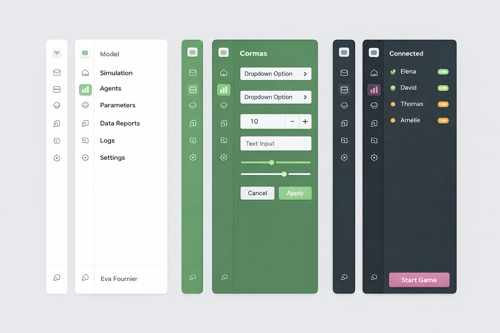

In this post I introduce a modern activity bar plus dockable sidebar for Cormas and explain why this pattern improves navigation, extensibility, and focus during modelling and simulation. I discuss the design goals behind adopting this interface and how it supports future plugins. Finally, I propose a concrete implementation strategy in Pharo using the Spec2 UI framework.

<!-- truncate -->

## What is it and why do we want it?

The Activity Bar plus Dockable Sidebar is a modern interface pattern where a vertical strip of icons acts as a navigation rail that lets users switch between different views, while a collapsible sidebar provides a flexible container that can appear, disappear, or change depending on the selected context. This approach scales well for complex applications because it keeps the interface compact, supports modular plugins, and allows users to quickly toggle tools without opening new windows or cluttering the main workspace.

Here is an example image generated by AI. It demonstrates how the sidebar can be used for different kinds of menus, value settings or logs and outputs.



The Activity Bar plus Dockable Sidebar works well for Cormas because it keeps the simulation at the center while letting users switch quickly between settings, parameters, analysis tools, etc. without opening many windows. It also supports a plugin oriented architecture, since new Cormas features can add their own views through icons without changing the main interface. This makes the UI cleaner, more scalable, and easier to use during modelling and participatory sessions.

## Implementation in Spec2

Let's implement this sidebar in Spec2. The way it is used can be similar to `SpNotebookPresenter`. Users create a notebook (sidebar) and add pages to it with custom presenters. Each page can have an icon and a label (can be displayed as help when hovering over the icon) as well as a presenter provider - a block which can be evaluated to the instance of the presenter that should be displayed in a dockable sidebar. We can reuse `SpNotebookPagePresenter` to represent the sidebar pages.

### Activity Bar

The activity bar will be composed of toggle buttons.

```smalltalk
SpPresenter << #CMActivityBar
	slots: { #buttons . #toggleButtons };
	package: 'Cormas-UI'
```

```smalltalk title="CMActivityBar"
initializePresenters
	buttons := OrderedCollection new.
	toggleButtons := OrderedCollection new
```

```smalltalk title="CMActivityBar"
addButtonIcon: anIcon help: aString action: aBlock
	buttons add: (self newButton
		icon: anIcon;
		help: aString;
		action: aBlock;
		yourself)
```

```smalltalk title="CMActivityBar" showLineNumbers
addToggleButtonIcon: anIcon help: aString whenActivatedDo: anActivatedBlock whenDeactivatedDo: aDeactivatedBlock

	| newButton |

	newButton := self newToggleButton
		icon: anIcon;
		help: aString;
		whenActivatedDo: anActivatedBlock;
		whenDeactivatedDo: aDeactivatedBlock;
		yourself.
		
	toggleButtons add: newButton.
		
	toggleButtons size > 1 ifTrue: [
		toggleButtons first associatedToggleButtons: toggleButtons allButFirst ]
```

```smalltalk title="CMActivityBar" showLineNumbers
defaultLayout

	| buttonsLayout |
	buttonsLayout := SpBoxLayout newTopToBottom.
	
	toggleButtons do: [ :button |
		buttonsLayout add: button height: self class activityButtonHeight ].
	
	buttonsLayout add: self newNullPresenter.
	
	buttons do: [ :button |
		buttonsLayout add: button height: self class activityButtonHeight ].
	
	^ buttonsLayout 
```

```smalltalk title="CMActivityBar class"
activityButtonHeight
	^ 40
```

```smalltalk title="CMActivityBar class"
example

	| activityBar |
	activityBar := self new.
	
	activityBar
		addToggleButtonIcon: (activityBar iconNamed: #package)
		help: 'Packages'
		whenActivatedDo: [ self inform: 'Packages displayed' ]
		whenDeactivatedDo: [ self inform: 'Packages hidden' ].
		
	activityBar
		addToggleButtonIcon: (activityBar iconNamed: #class)
		help: 'Classes'
		whenActivatedDo: [ self inform: 'Classes displayed' ]
		whenDeactivatedDo: [ self inform: 'Classes hidden' ].
		
	activityBar
		addButtonIcon: (activityBar iconNamed: #configuration)
		help: 'Settings'
		action: [ self inform: 'Open settings!' ].

	activityBar open
```

### Dockable Sidebar

```smalltalk
SpPresenter << #CMDockableSidebar
	slots: { #activityBar . #sidebar . #pages };
	package: 'Cormas-UI'
```

```smalltalk title="CMDockableSidebar"
initializePresenters
	activityBar := self instantiate: CMActivityBar
```

```smalltalk title="CMDockableSidebar"
layoutWithSidebarHidden
	^ SpBoxLayout newLeftToRight
		add: activityBar width: activityBar class activityButtonHeight;
		yourself
```

```smalltalk title="CMDockableSidebar"
layoutWithSidebarShown
	^ SpBoxLayout newLeftToRight
		add: activityBar width: activityBar class activityButtonHeight;
		
		"This is a hack. We have to use a null presenter instead of spacing
		because otherwise the parent layout can't calculate size correctly
		when using expand: false"
		add: self newNullPresenter width: 5;
		
		add: sidebar width: 250;
		yourself
```

```smalltalk title="CMDockableSidebar"
defaultLayout
	^ self layoutWithSidebarHidden
```

```smalltalk title="CMDockableSidebar" {3,7}
hideSidebar
	self layout: self layoutWithSidebarHidden.
	owner layout: owner layout
	
showSidebar
	self layout: self layoutWithSidebarShown.
	owner layout: owner layout
```

```smalltalk title="CMDockableSidebar"
addPage: aPage

	activityBar
		addToggleButtonIcon: aPage icon
		help: aPage title
		whenActivatedDo: [ 
			sidebar := aPage retrievePresenter.
			self showSidebar ]
		whenDeactivatedDo: [ self hideSidebar ]
```

And a method to add a button which simply delegates to the activity bar.

```smalltalk title="CMDockableSidebar"
addButtonIcon: anIcon help: aString action: aBlock

	activityBar addButtonIcon: anIcon help: aString action: aBlock
```

## Usage Example

```smalltalk
SpPresenter << #CMDockableSidebarExample
	slots: { #sidebar . #mainPresenter };
	package: 'Cormas-UI'
```