# How to Contribute to Cormas

This tutorial will teach you how to contribute to Cormas by resolving issues and making pull requests to [our repository](https://github.com/cormas/cormas) on GitHub.

**Prerequisite:** Before going any further, you need to make sure that you have a GitHub account and that you can authenticate with SSH keys. Follow those steps from our [GitHub tutorial](github):

1. [Create a GitHub account](github?id=step-1-create-a-github-account)
2. [Generate SSH keys](github?id=step-2-generate-ssh-keys)

## Select an issue

All issues Cormas-related issues are recorded on our [issue tracker](https://github.com/cormas/cormas/issues). You can open it be clicking on the _"Issues"_ button on [our repository](https://github.com/cormas/cormas). 

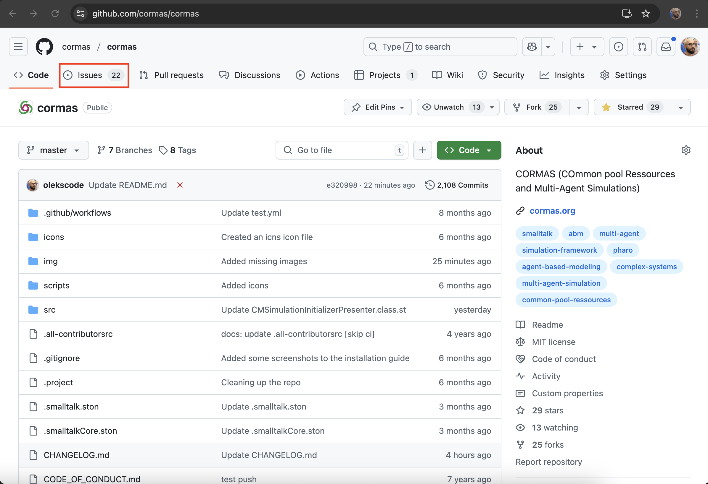
 
You will see the list of open issues. Most issues will have one or multiple labels associated with them. If you are a newcomer, we recommend that you start with [good first issue](https://github.com/cormas/cormas/issues?q=is%3Aissue%20state%3Aopen%20label%3A%22good%20first%20issue%22) label. Those issues are selected by experienced developers as a recommended practice for new contributors. They are usually small and easy to resolve.


In this tutorial, I will be working on [issue #699](https://github.com/cormas/cormas/issues/699) which asks to add a _"Browse"_ option to the context menu of the entity. I click on the issue, read its description and the discussion section. Then I **leave a comment** indicating that I am working on it. This will prevent other contributors from taking on the same issue.

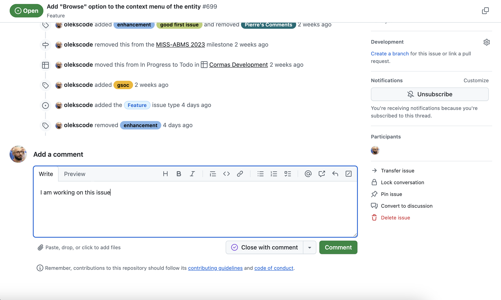

## Create a fork

Since you don't have access to commit to Cormas repository directly, you must create a [fork](https://docs.github.com/en/pull-requests/collaborating-with-pull-requests/working-with-forks/fork-a-repo) - a copy of this repository on your GitHub account. You will modify this fork and then submit the changes to the original repository as a [pull request](https://docs.github.com/en/pull-requests/collaborating-with-pull-requests/proposing-changes-to-your-work-with-pull-requests/about-pull-requests). We (Cormas developers) will review your proposed changes and either accept (merge) them or ask you to change something. You can create a fork by clicking on the _"Fork"_ button in the top-right corner of [our repository](https://github.com/cormas/cormas).

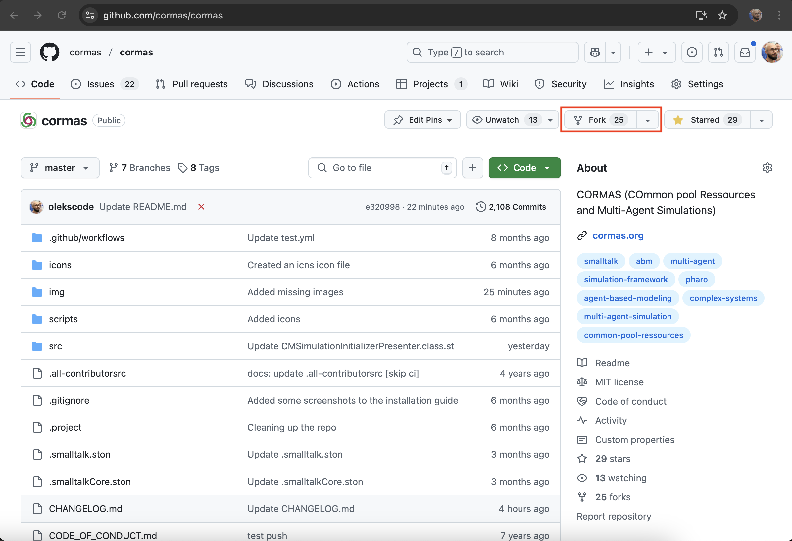

You can leave all the default settings (repository name, your GitHub account, description, etc.) but be sure to uncheck the checkbox _"Copy the master branch only"_ because you will be working on the `dev` branch.

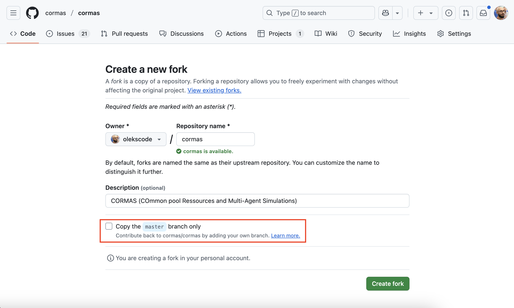

After you click on the _"Create fork"_ button, the new fork will be created and opened automatically. 

You will see that repository is now linked tou your account. There will also be an indication that the `master` branch of your fork is up to date with the `master` branch of the original cormas repository.

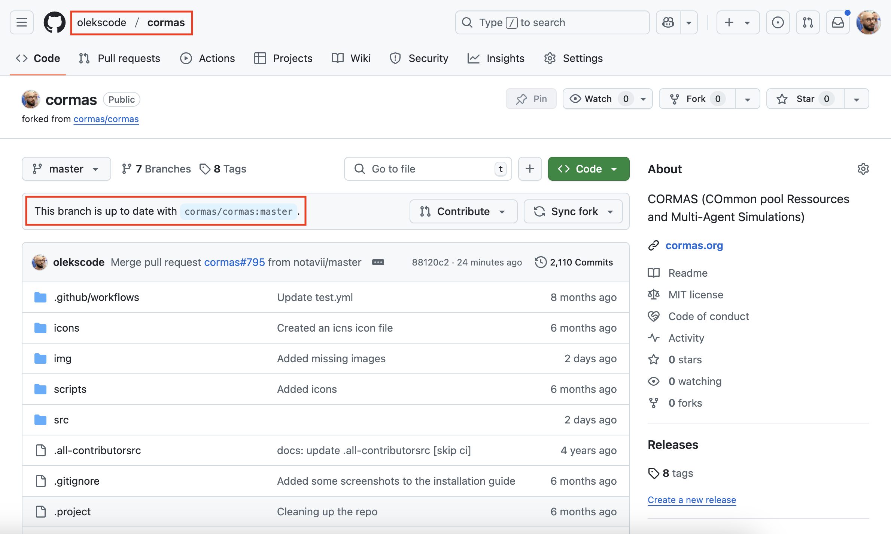

## Create a new Pharo image and load Cormas

[Create and open](install?id=step-2-create-a-pharo-image) a new Pharo image. In the Playground, execute the following script but **replace my username** (olekscode) **with yours**:

```st
Metacello new
    repository: 'github://olekscode/cormas:dev';
    baseline: 'Cormas';
    load.
```

This step is the same as the [Loading Cormas](install?id=loading-cormas) section of the [installation tutorial](install) but instead of loading the `master` branch of the central repository with `github://cormas/cormas`, we load the `dev` branch of our fork with `github://<username>/cormas:dev`.

## Specify your SSH keys

Now we must specify the location of our SSH keys to make sure that Pharo image can authenticate to GitHub and make commits from your account. If you don't have the SSH keys yet, please follow the [Generate SSH keys](github?id=step-2-generate-ssh-keys) step of our [GitHub tutorial](github). Click on _"Browse"_ in the world menu and then on _"Git Repositories Browser"_ (a tool also known as _"Iceberg"_). 

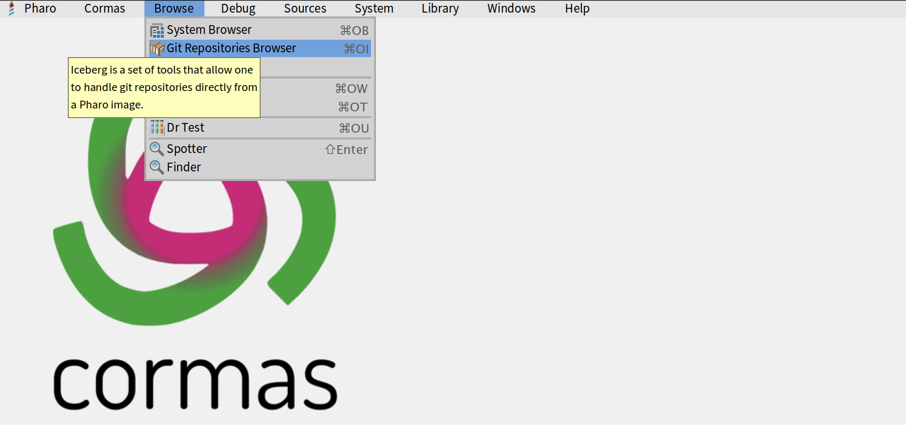

Now click on the _"Settings"_ button in the top-right corner of the repositories browser.

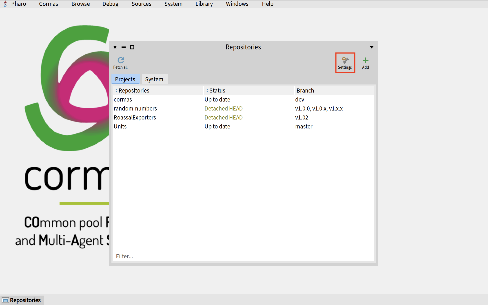

In the settings browser, select _"Credentials"_, check the _"Use custom SSH keys..."_ checkbox and make sure that both public and private SSH keys point to the correct location on your computer. Now you can close the settings browser, your changes will be automatically saved.

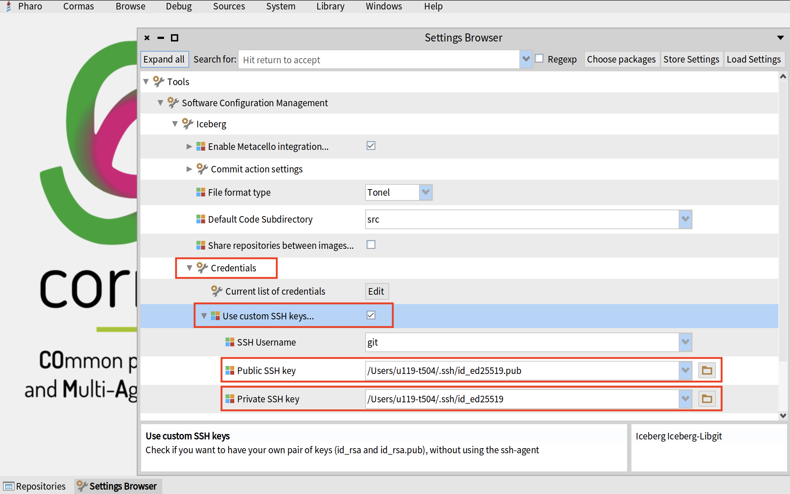

## Create a new branch for issue

It is possible that while you make your changes, someone else will push their own changes to Cormas.
Then you will be forced to pull those changes and resolve potential conflicts before pushing your own changes.
To simplify this process, it is a good practice to create a separate branch for the issue that you are resolving and, once you are done, make a pull request merging this branch into the original branch (dev).

Pharo automates all this process for you.
In _"Git Repositories Browser"_ (Iceberg), right-click on _cormas_, select _"GitHub"_ and then _"Create new branch for issue"_.

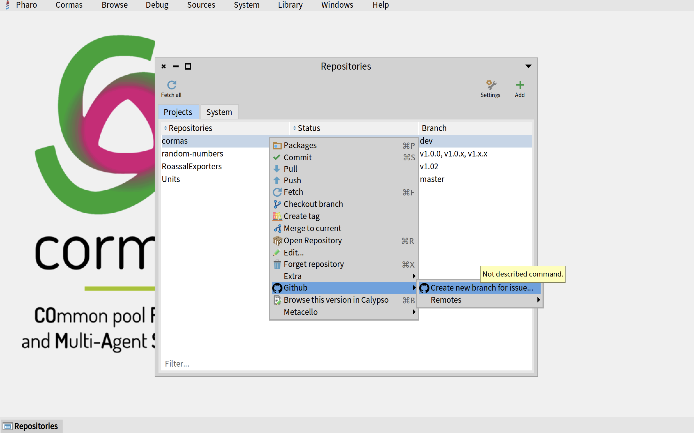

You must now specify the remote repository that has the list of issues.
This should be the central Cormas repository.
But at this point, Pharo only has the link to your remote repository.
So we must add another remote.
To do that, click on the _"Add remote"_ button (the one with a green plus "+").

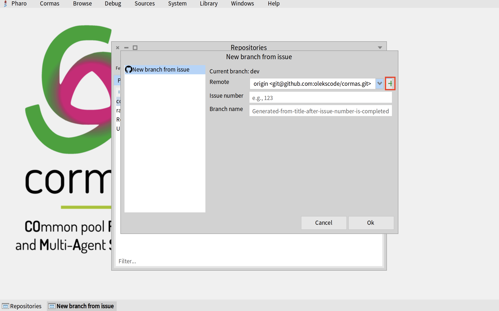

Now give the name to your remote.
I call mine "cormas" but you can choose any name that you like.
Remote URL should be the SSH address that you copy on GitHub.
For Cormas repository it's _"git@github.com:cormas/cormas.git"_.
Once you have completed both fields, click on the _"OK"_ button.

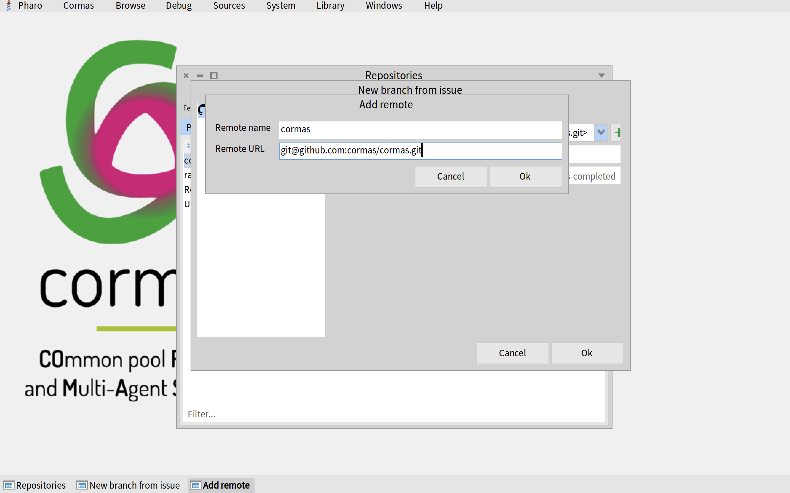

Sometimes, this action will produce an error similar to the one below.
This is a bug of Git Repositories Manager.
You can ignore it and simpy close the debugger window.

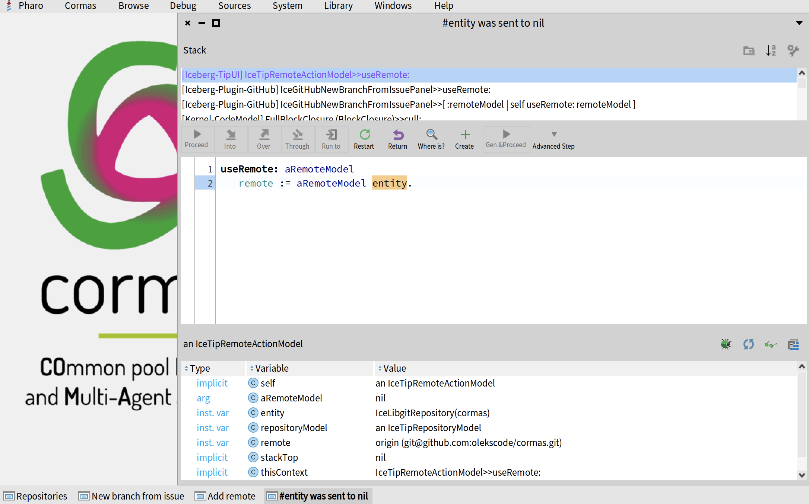

Now you can select Cormas repository from the list of remotes.
Write the issue number in the second field.
The number of my issue is 699 - it's the issue that I selected in the [Select an issue](#select-an-issue) section of this tutorial.
If you did everything correctly, the branch name field will be auto-completed with your issue title that will be automatically retrieved from GitHub.

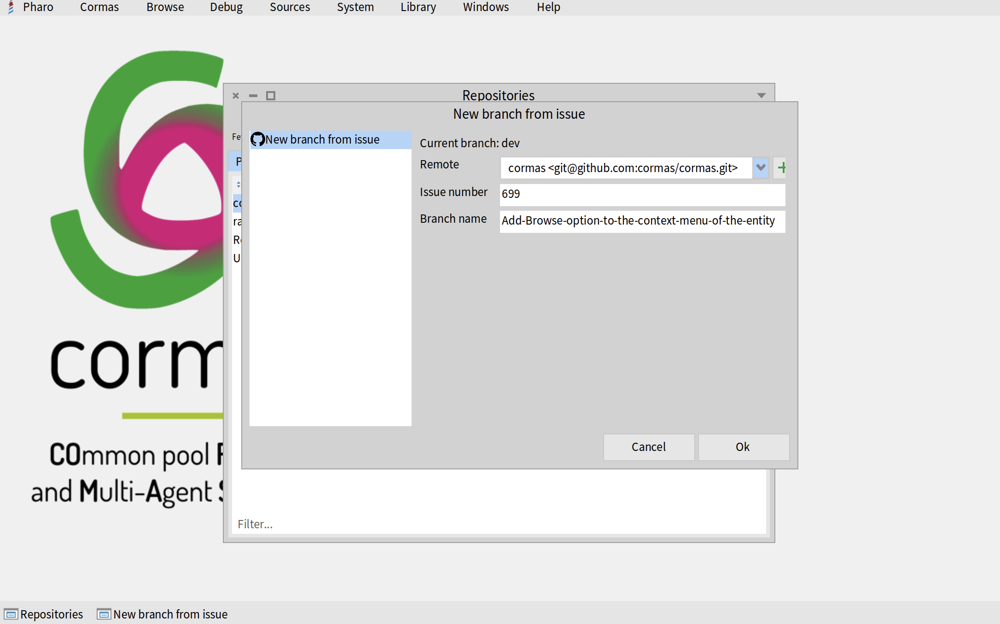

Once you click _"OK"_, the new branch will be created.
You can see the name of this branch next in the _"Branch"_ column of the _"Repositories"_ table.

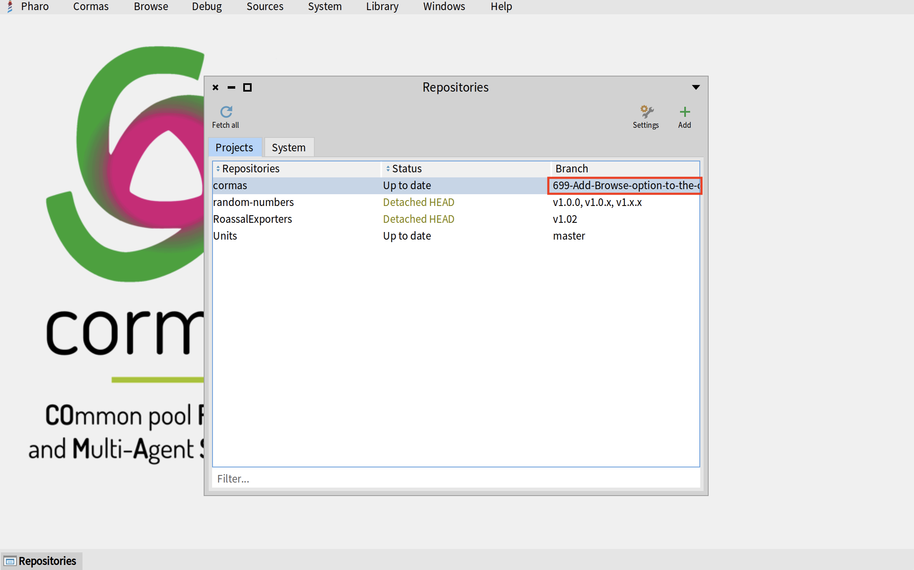

## Make changes

Now you can write the code to resolve your issue.
In my case, I have to add a _"Browse"_ button to the context menu of all entities in a spatial grid visualization.
To do that, I make the following changes (you do not need to understand them because your changes will be different anyway).

First, I add a new subclass of `CMSpaceContextMenuCommand` and call it `CMBrowseSpaceContextMenuCommand`.

```st
CMSpaceContextMenuCommand << #CMBrowseSpaceContextMenuCommand
	slots: {};
	package: 'Cormas-UI-Commands'
```

I implement three required methods: `name`, `icon`, and `action` (notice that in the `name` method I call the `tBrowse` method of translator which will return the string in a different language depending of which tranlator is used).

```st
CMBrowseSpaceContextMenuCommand >> name
	^ translator tBrowse

CMBrowseSpaceContextMenuCommand >> icon
	^ self iconNamed: #smallSystemBrowser

CMBrowseSpaceContextMenuCommand >> action
	^ owner class browse
```

Then I register my new command by adding it to the collection inside the `CMBrowseSpaceContextMenuCommand >> contextMenuItemsFor:` method.

```st
CMBrowseSpaceContextMenuCommand >> contextMenuItemsFor: anEntity
	^ {
		CMInspectSpaceContextMenuCommand forOwner: anEntity .
		CMBrowseSpaceContextMenuCommand forOwner: anEntity
	}
```

I verify that my changes are correct and everything works well.
Now I am ready to commit and push my changes.

## Commit and push

If you open _"Git Repositories Browser"_ after making your changes, you will see that _cormas_ repository is green and has a status _"Uncommitted changes"_ (sometimes we say that it's a _"dirty repository"_).

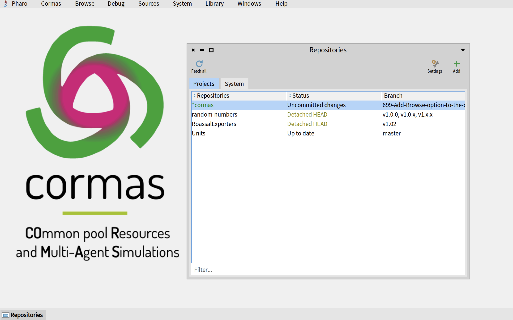

Double-click on _cormas_ repository to see the list of packges.
The ones that you modified will also be green.
You can now click on the _"Commit"_ button in the top-left corner.

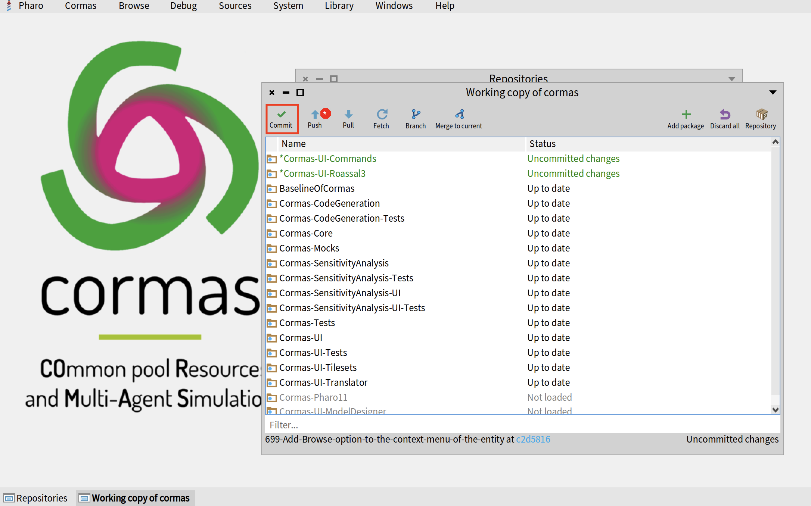

Carrefully go through the list of changes that you are about to commit.
If there are some changes that are not supposed ton be included into this pull reques, make sure to uncheck them.
Then write a meaningful commit message.
If you are fixing an issue, it is a good practice to start your message with a special word _"Fixed"_ followed by a space, a hash, and the issue number.
For example, my message is _"Fixed #699. Added a Browse button to the context menu of all entities"_.
**GitHub will automatically detect the _"Fixed #699"_ part and close issue #699 as soon as your pull request is merged** (accepted).
Once you wrote your message, click on the _"Commit"_ button in the bottom-right corner.

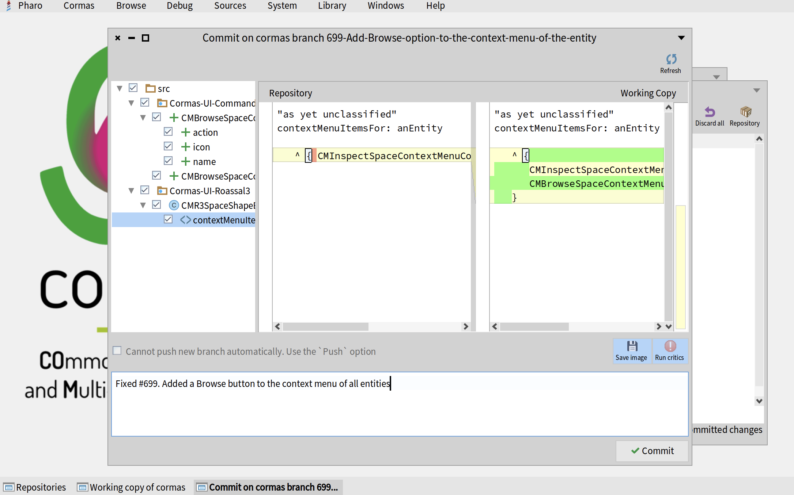

At this point, you might get a list of **critiques** - optional suggestions on how to improve your code.
Try to take them into account, then click the _"Update"_ button.
When you are done, you can click on _"Commit"_.
You can also ignore the critiques if you find them irrelevant and click on _"Commit"_ without fixing them.

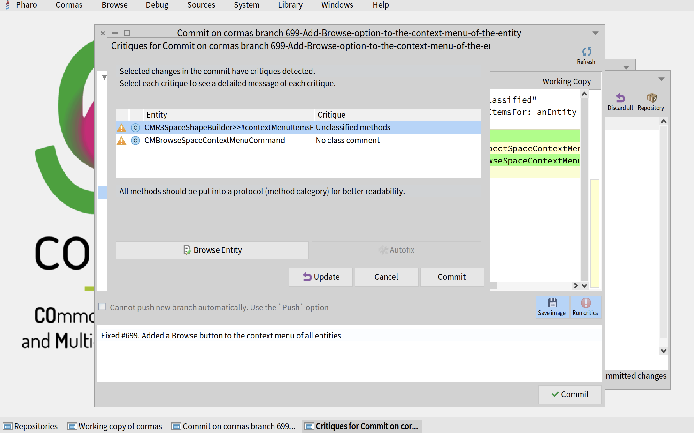

Click on the _"Push"_ button in the top-left corner of teh _"Working copy of cormas"_ window.


**Make sure to select your own remote repoository and not the central repository of cormas**. Otherwise your push will be rejected because you don't have the access rights to push to Cormas directly (also, it is not a very good practice, even for the core developers).
Then click on the _"Push"_ button in the bottom-left corner.

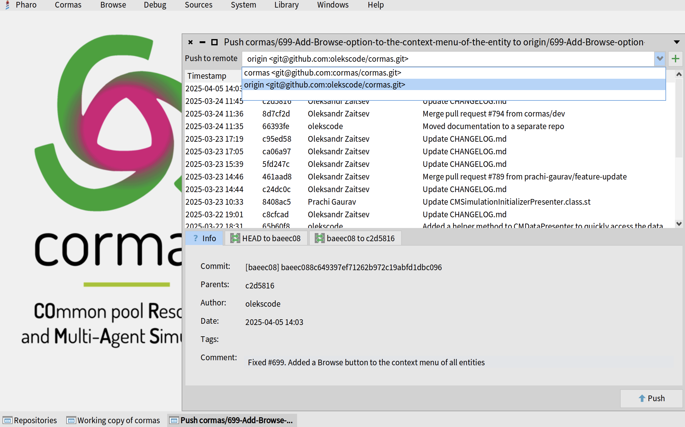

## Open a pull request

Now open GitHub in your web browser and go to your fork of Cormas.
You should see a yellow message saying that there is a branch with a recent push.
Click on _"Compare & pull request"_.

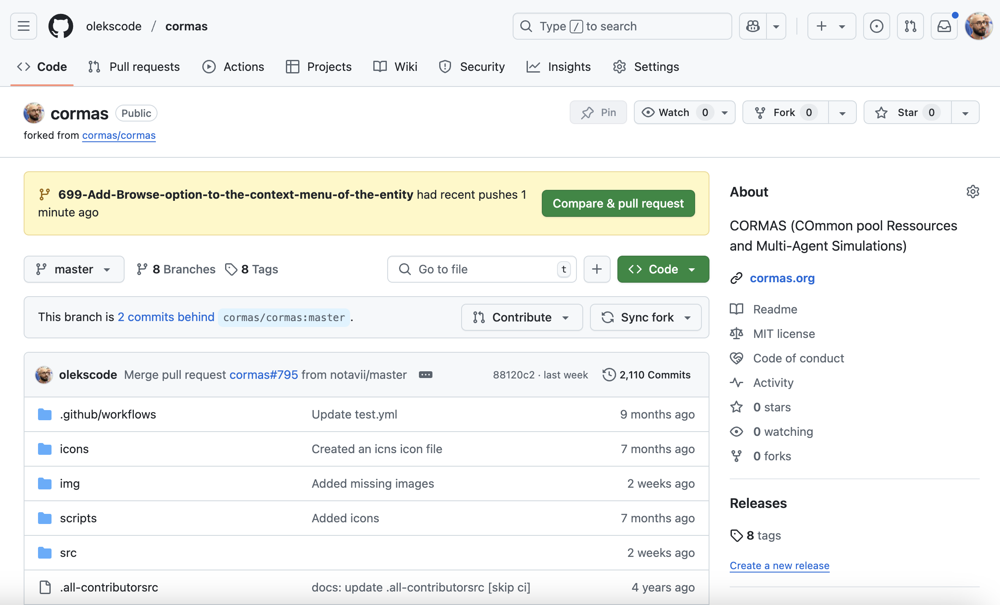

Make sure that you are making a pull request to the _dev_ branch and not to the _master_ branch.
We do not accept any PRs to _master_.

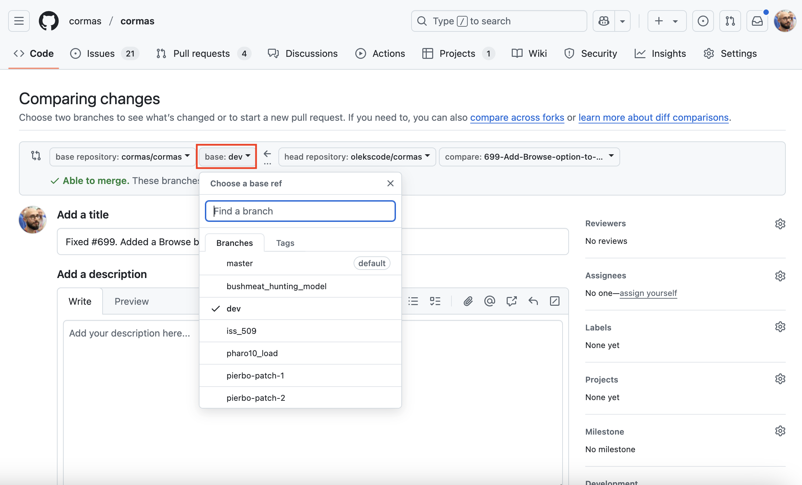

Congratulations! You have just submitted your first pull request :)

We will review it as soon as we can and either merge it  (accept your changes) or ask you to modify something.
If nobody reacts to your PR in several days, don't hesitate to send us a message on Discord - most core developers of Cormas are researchers and sometimes we can be busy with other tasks and simply forget to respond to your PR.

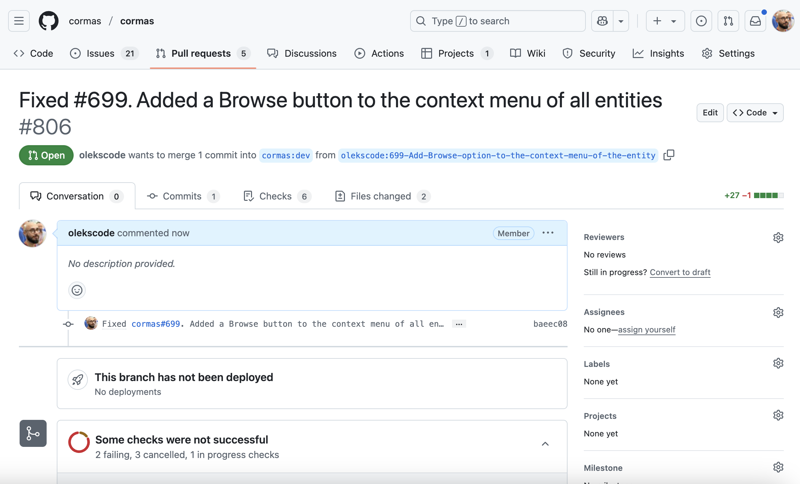