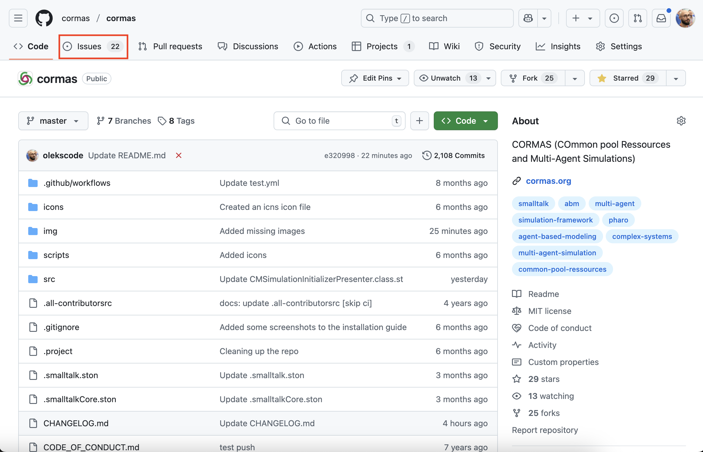
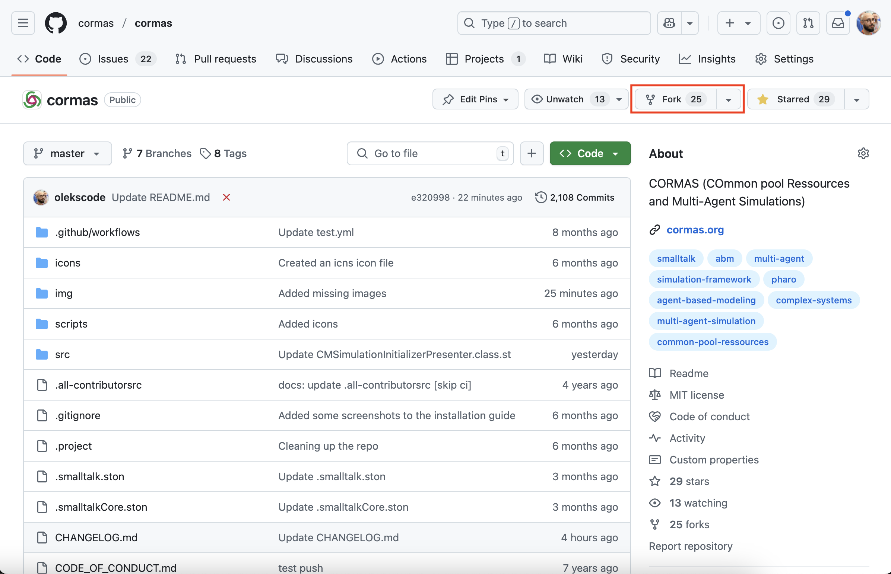

# How to Contribute to Cormas

This tutorial will teach you how to contribute to Cormas by resolving issues and making pull requests to [our repository](https://github.com/cormas/cormas) on GitHub.

**Prerequisite:** Before going any further, you need to make sure that you have a GitHub account and that you can authenticate with SSH keys. Follow those steps from our [GitHub tutorial](github):

1. [Create a GitHub account](github?id=step-1-create-a-github-account)
2. [Generate SSH keys](github?id=step-2-generate-ssh-keys)

## Select an issue

All issues Cormas-related issues are recorded on our [issue tracker](https://github.com/cormas/cormas/issues). You can open it be clicking on the _"Issues"_ button on [our repository](https://github.com/cormas/cormas). 


 
You will see the list of open issues. Most issues will have one or multiple labels associated with them. If you are a newcomer, we recommend that you start with [good first issue](https://github.com/cormas/cormas/issues?q=is%3Aissue%20state%3Aopen%20label%3A%22good%20first%20issue%22) label. Those issues are selected by experienced developers as a recommended practice for new contributors. They are usually small and easy to resolve.


In this tutorial, I will be working on [issue #699](https://github.com/cormas/cormas/issues/699) which asks to add a _"Browse"_ option to the context menu of the entity. I click on the issue, read its description and the discussion section. Then I **leave a comment** indicating that I am working on it. This will prevent other contributors from taking on the same issue.


## Create a fork

Since you don't have access to commit to Cormas repository directly, you must create a [fork](https://docs.github.com/en/pull-requests/collaborating-with-pull-requests/working-with-forks/fork-a-repo) - a copy of this repository on your GitHub account. You will modify this fork and then submit the changes to the original repository as a [pull request](https://docs.github.com/en/pull-requests/collaborating-with-pull-requests/proposing-changes-to-your-work-with-pull-requests/about-pull-requests). We (Cormas developers) will review your proposed changes and either accept (merge) them or ask you to change something. You can create a fork by clicking on the _"Fork"_ button in the top-right corner of [our repository](https://github.com/cormas/cormas).



You can leave all the default settings (repository name, your GitHub account, description, etc.) but be sure to uncheck the checkbox _"Copy the master branch only"_ because you will be working on the `dev` branch.


After you click on the _"Create fork"_ button, the new fork will be created and opened automatically. 

You will see that repository is now linked tou your account. There will also be an indication that the `master` branch of your fork is up to date with the `master` branch of the original cormas repository.


## Create a new Pharo image and load Cormas

[Create and open](install?id=step-2-create-a-pharo-image) a new Pharo image. In the Playground, execute the following script but **replace my username** (olekscode) **with yours**:

```st
Metacello new
    repository: 'github://olekscode/cormas:dev';
    baseline: 'Cormas';
    load.
```

This step is the same as the [Loading Cormas](install?id=loading-cormas) section of the [installation tutorial](install) but instead of loading the `master` branch of the central repository with `github://cormas/cormas`, we load the `dev` branch of our fork with `github://<username>/cormas:dev`.

## Specify your SSH keys

Now we must specify the location of our SSH keys to make sure that Pharo image can authenticate to GitHub and make commits from your account. If you don't have the SSH keys yet, please follow the [Generate SSH keys](github?id=step-2-generate-ssh-keys) step of our [GitHub tutorial](github). Click on _"Browse"_ in the world menu and then on _"Git Repositories Browser"_ (a tool also known as _"Iceberg"_). 


Now click on the _"Settings"_ button in the top-right corner of the repositories browser.


In the settings browser, select _"Credentials"_, check the _"Use custom SSH keys..."_ checkbox and make sure that both public and private SSH keys point to the correct location on your computer. Now you can close the settings browser, your changes will be automatically saved.


## Create a new branch for issue


## Make changes

## Commit and push

## Open a pull request