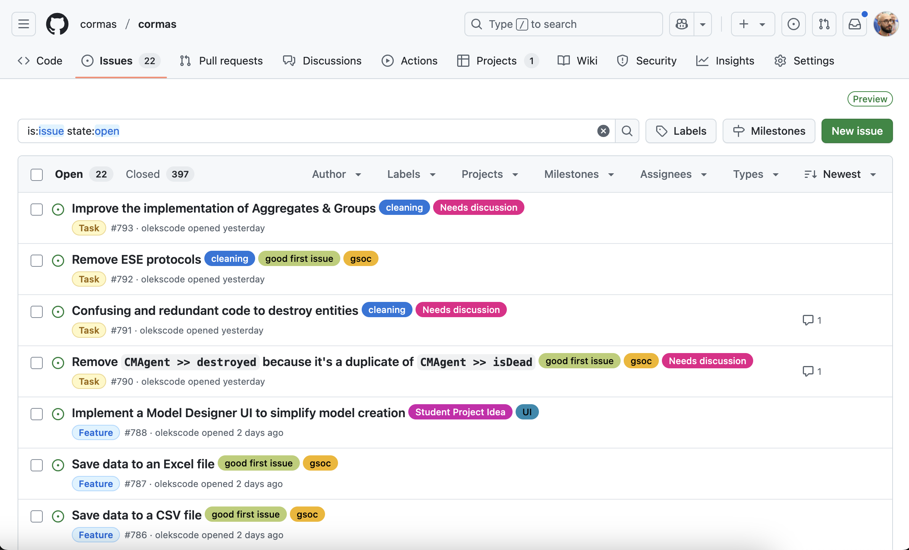
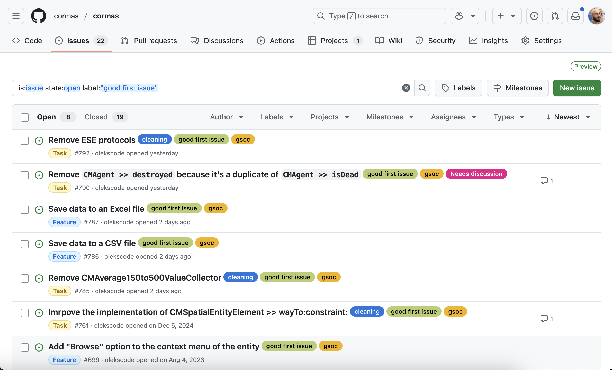

# How to Contribute to Cormas

This tutorial will teach you how to contribute to Cormas by resolving issues and making pull requests to [our repository](https://github.com/cormas/cormas) on GitHub.

**Prerequisite:** Before going any further, you need to make sure that you have a GitHub account and that you can authenticate from your Pharo image. Follow those steps from our [GitHub tutorial](github):

1. [Create a GitHub account](github?id=step-1-create-a-github-account)
2. [Generate SSH keys](github?id=step-2-generate-ssh-keys)
3. [Open Iceberg and add your SSH keys to Pharo](github?id=step-3-open-iceberg-and-add-your-ssh-keys)

## Select an Issue

All issues Cormas-related issues are recorded on our [issue tracker](https://github.com/cormas/cormas/issues). You can open it be clicking on the _"Issues"_ button on [our repository](https://github.com/cormas/cormas). 

You will see the list of open issues. Most issues will have one or multiple labels associated with them.

If you are a newcomer, we recommend that you start with [good first issue](https://github.com/cormas/cormas/issues?q=is%3Aissue%20state%3Aopen%20label%3A%22good%20first%20issue%22) label. Those issues are selected by experienced developers as a recommended practice for new contributors. They are usually small and easy to resolve.

