# Saving and Sharing Your Cormas Models on GitHub

**Version control systems** (VCS) are certainly among the most important instruments in any modern programmer's toolkit.
They help us keep track of all the changes that we make to our code in the form of **commits**, saving them on a **remote** server, and thus making sure that nothing is ever lost and any bad change can always be reverted.
They also let us share our code with others, making it easy for multiple programmers to collaborate on the same piece of source code and managing any potential **conflicts** (for example, when two people try to modify the same lines of code simultaneously).

**Git** is by far the most popular version control system today.
It was originally created by Linus Torvalds to support the development of the first Linux kernel.
Git is free and open-source, anyone can install it on their computer and use it in their projects.
If you want to learn more about Git, I highly recommend you to read the first chapters of the official [Git Book](https://git-scm.com/book/).
It is free and available in different formats (online, PDF, EPUB) and many different languages.

Although you can use Git locally on your computer or host it on your own server, most people use free online platforms such as [GitHub](https://github.com/) or [Gitlab](https://gitlab.com/).

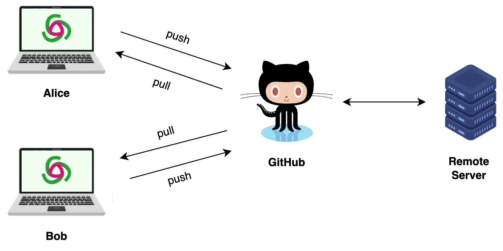

In this tutorial, you will learn how to create a **repository** (project) on GitHub, add your Pharo packages to this repository, commit your changes and push them to the remote reposiitory, pull changes that are made by others.

> **Fun fact:** The creature on the image above is called an _Octocat_. It is the official mascot of GitHub - a cat with eight tentacles.

## Should You Publish Your Models on GitHub?

## GitHub with Cormas Tutorial

### Step 1. Create a GitHub account

If you don't have one already, you should create your GitHub account.
To do that, go to <https://github.com/signup> and follow the instructions.
It is simple and straightforward and the entire process will take you less than 5 minutes.


### Step 2. Generate SSH keys

When you use GitHub in your project, you will need to authenticate to your account (prove that it is actually you and not someone else).
In the past, you could enter your login and password, but now GitHub requires something called a _"personal access token"_ instead of password because it is more secure (more information: [About authentication to GitHub](https://docs.github.com/en/authentication/keeping-your-account-and-data-secure/about-authentication-to-github)).

An alternative way of authentication is by using SSH keys. We recommend this aproach because, even though it may take a couple minutes to set up, it will save you time in the long run.

You will start by generating a pair of secure keys on your computer: _a public key_ and _a private key_. Then you will add the public key to your GitHub account. Every time you will use GitHub on your computer, it will compare the public and private keys and as long as they align, authentication will happen automatically.

> In other words, SSH keys are a very secure way to make GitHub remember your computer and not have to ask you for passwords or personal tokens.

On GitHub Docs there is a very detailed guide on [Connecting to GitHub with SSH](https://docs.github.com/en/authentication/connecting-to-github-with-ssh). It is adapted to each operating system: Windows, Linux, or Mac. Specifically, you need to follow those three steps:

1. [Checking for existing SSH keys](https://docs.github.com/en/authentication/connecting-to-github-with-ssh/checking-for-existing-ssh-keys)
2. [Generating a new SSH key and adding it to the ssh-agent](https://docs.github.com/en/authentication/connecting-to-github-with-ssh/generating-a-new-ssh-key-and-adding-it-to-the-ssh-agent)
3. [Adding a new SSH key to your GitHub account](https://docs.github.com/en/authentication/connecting-to-github-with-ssh/adding-a-new-ssh-key-to-your-github-account)

After completing those steps, you should have two files on your computer: one with public and one with private ssh key. Remember their location because you will need to specify it in the next step. For example, for me those are:

- `/Users/zaitsev/.ssh/id_ed25519` _(private key)_
- `/Users/zaitsev/.ssh/id_ed25519.pub` _(public key)_ 

?> If you have trouble following those steps, do not hesitate to ask a question on [our Discord server](contact).

### Step 3. Open Iceberg and Add Your SSH Keys

To work with GitHub from within Cormas, we use a tool called Iceberg (Git Repositories Browser) which is included in any modern Pharo image.
Iceberg allows you to load different git repositories, keep track of all your changes, prepare commits, push those commits to a remote server, and pull commits that were made by others.
Let us start by opening Iceberg.
To do that, in your Cormas image, you should select _"Browse"_ in the top menu and then click on _"Git Repositories Browser"_.
Alternatively, you can use a shortcut: _Ctrl+OI_ on Windows and Linux or _Cmd+OI_ on Mac.


Before using Iceberg, you must first specify the location of your SSH keys.
This way, Iceberg will be able to perform authentication when you push changes to your repositories.

Open settings by pressing the _"settings"_ button in the right corner as it is shown in the next picture.

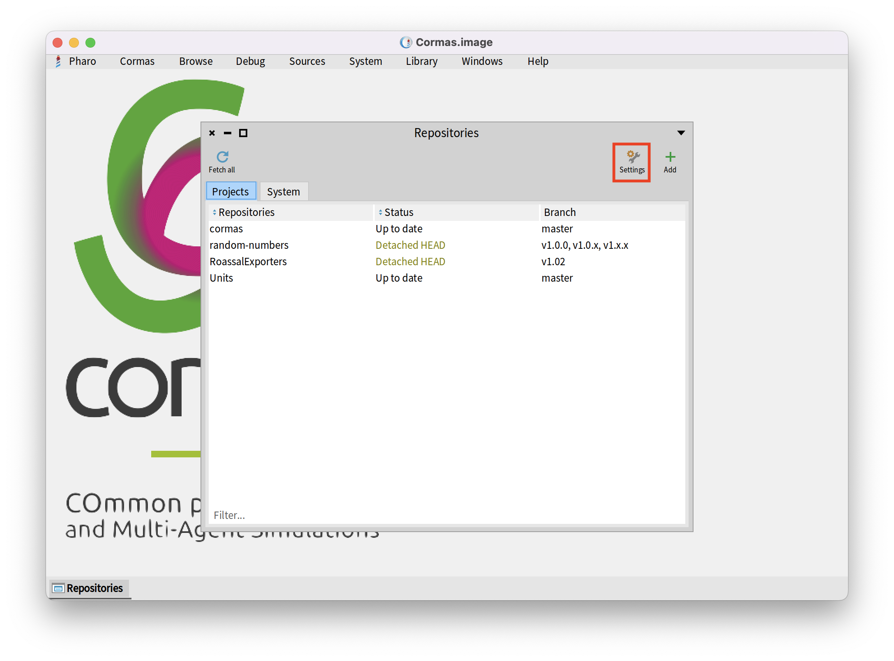
Then, follow the order of the numbers as shown in the next picture:
First, click on "Credentials", which will open "Use custom SSH keys" with a checkbox. Make sure to check it. This will open new dropdowns: "Public SSH key" and "Private SSH key", where you should add your keys from your personal computer.

Then you should follow the order of the numbers as it is shown on the next picture:
First, click on  _"Credentials"_, which will open _"Use custom SSH keys"_  with a checkbox. Make sure to check it. This will open new dropdowns: _"Public SSH key"_ and _"Private SSH key"_, where you should add your keys from your personal computer.

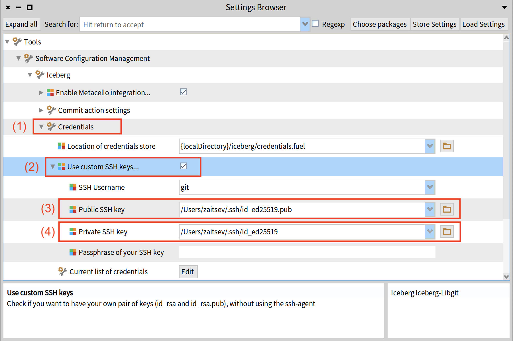

### Step 4. Create a GitHub Repository
To create a new repository press on the big _+_ located in the top right corner and then press _"New repository"_. 
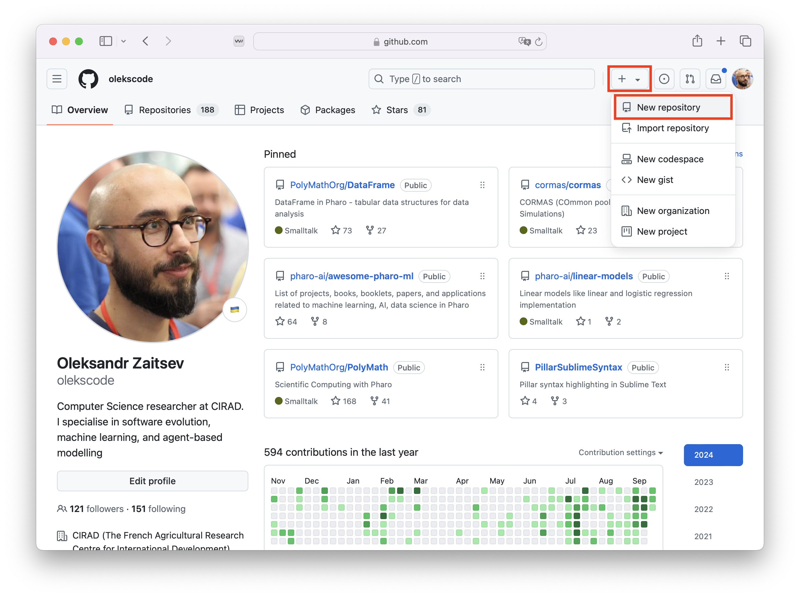

It will open a new tab in which you should follow the steps as shown in the next picture:  

First, you should name your repository. Choose a clear and descriptive name that reflects the project's purpose.  

Write a small description to explain what your repository is about and why it exists. This helps others understand its purpose and usage.  

Choose public or private visibility. Since we are an open-source community, a public repository is the recommended choice. :)  

A _README_ file is useful because it provides an introduction to your project. To include it, check the _"Add a README file"_ option. (For more details, follow the link to the documentation about READMEs.)  

A _.gitignore_ file helps exclude unnecessary files from version control. Select _Smalltalk_ from the list to automatically ignore irrelevant files. (Learn more about _.gitignore_ on the link provided by GitHub)  

Choose a license. The Pharo community uses the MIT license, which allows broad reuse while maintaining attribution.  

Finally, press _"Create repository"_.  

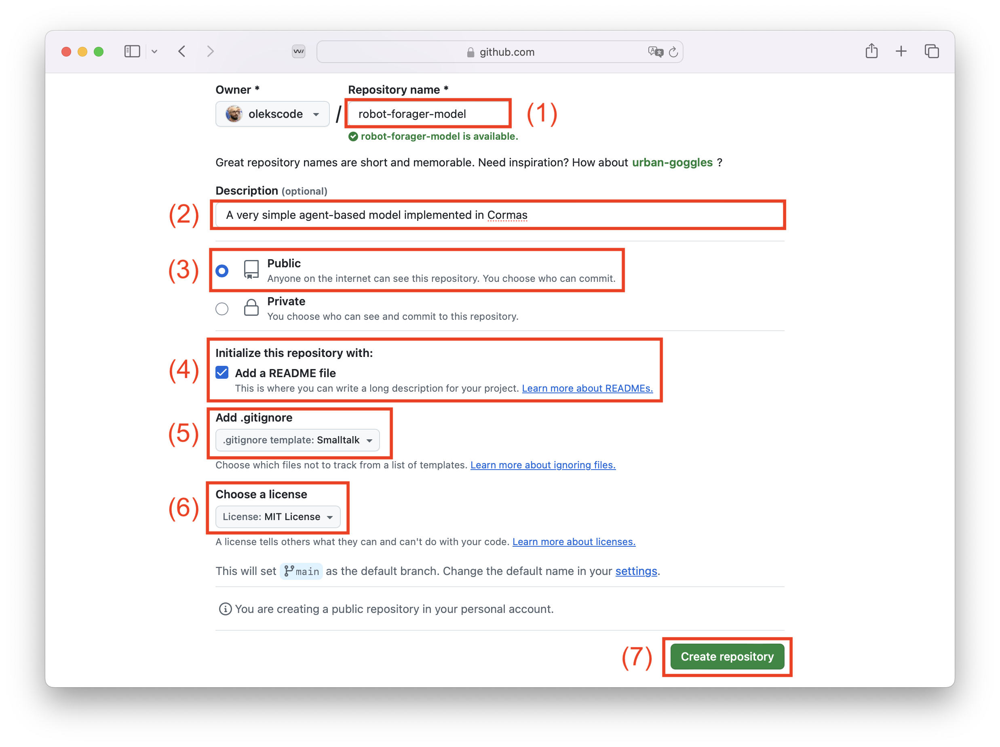

Once created, your repository will look like the one shown in the next picture. It will contain the files you selected, including the _README_, and will be ready for you to start adding code!

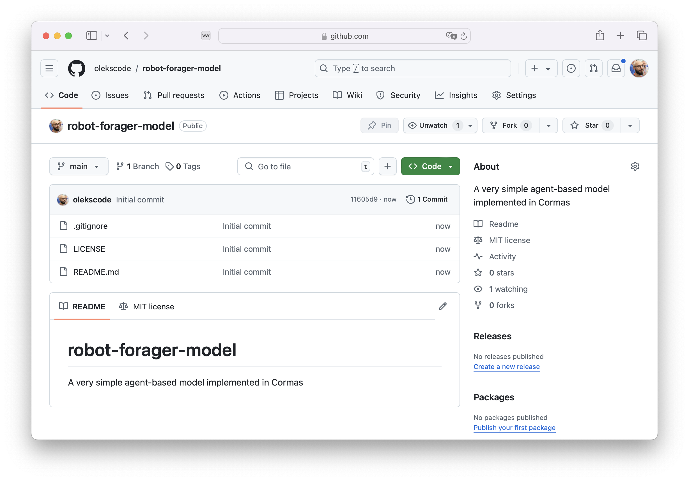

### Step 5. Load Your Repository With Iceberg

To load your repository open the Iceberg and press _"Add"_ button in the top right corner. 


First, you have to choose "Clone from github.com" option in the left box of the new tab. It will show you three spaces you have to fill. In "Owner name", write your GitHub nickname. In "Project name", you have to write the name of the repository you created in the previous step. In "Protocol", choose the option "SSH". In the end, press the button "Ok" at the bottom right corner. If you didn't make any mistakes, it should proceed correctly.

First, you have to choose _"Clone from github.com"_ option in the left box of the new tab. It will show you three spaces you have to fill. In _"Owner name"_, write your GitHub nickname. In _"Project name"_, you have to write the name of the repository you created in the previous step. In _"Protocol"_, choose the option _"SSH"_. In the end, press button _"Ok"_ at the bottom right corner. If you've entered everything correctly, the process should proceed smoothly. If not, double-check your inputs, they should match your GitHub keywords from the previous step.

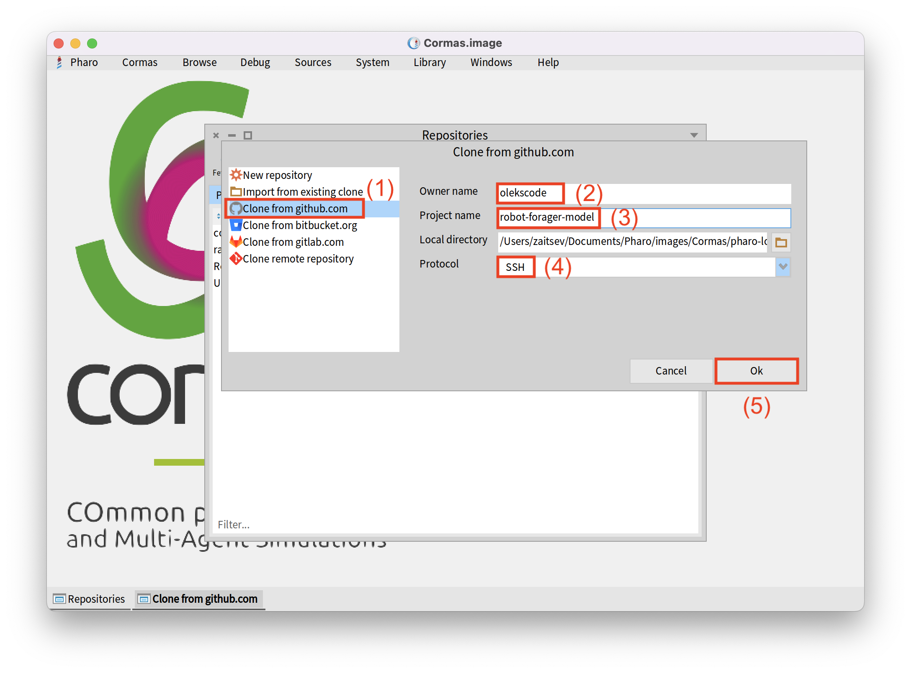

### Step 6. Set Up a Pharo Project in Your Repository

Now, we want to set up a Pharo project in our repository. Normally, the status of our repository should be _"No project found"_, because our repository still does not have any project in it. To fix this, right-click on the repository and then click _"Repair repository"_. This will help us repair our repository when it is detached.


As it is written, "Cannot find a project (meta-data and source directory) in your repository." We need to do this because Pharo relies on specific meta-data to identify and organize the project structure. Without the correct meta-data pointing to the source code directory, the system won’t be able to recognize the project and manage it properly.


Now you must select the directory in which the source code of your project will be stored.
You are free to choose the root directory (`robot-forager-model`) but it is a good practice to keep code separate from documentation and other files in your repository.
We recommend you to create a new directory called `src` and save your code there.
To add a new directory, click on the _"Add"_ button. 

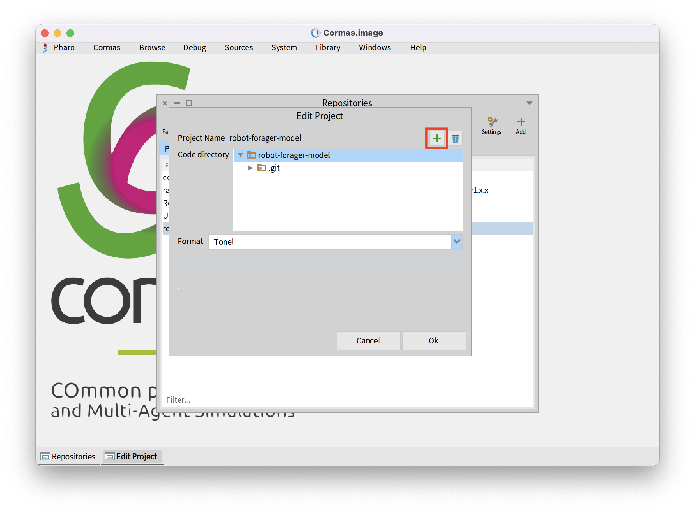

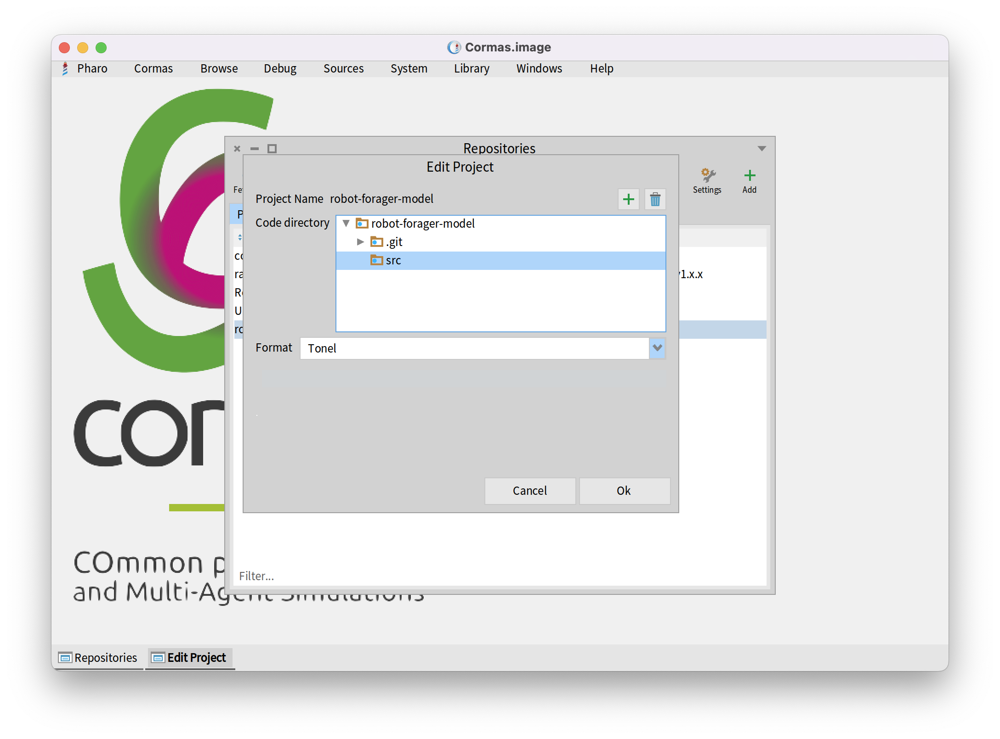

> **Deeper understanding** _(optional)_ : To see what happened, open the directory on your computer where Cormas image is located. You can find its path by executing `FileSystem workingDirectory` in the Playground and printing the result. Then navigate to `pharo-local/iceberg/<your github user name>/robot-forager-model`. Here you will find the contents of your repository (we call it the _local copy_). You will notice that the `src` directory was created, along with a file called `.project`. This file contains one entry, specifying that the code of your project will be located in the `src` directory.
> 
> ```
> {
>   'srcDirectory' : 'src'
> }
> ```
> Inside the `src` directory, you will also find the `.properties` file specifying that the source code of your project should be stored in [Tonel format](https://github.com/pharo-vcs/tonel).
>
> ```
> {
>   #format : #tonel
> }
> ```
> Those two files are called _"project metadata"_. They help Iceberg understand how to extract packages, classes, and methods from your repository.

### Step 7. Create Packages and Write Some Code
Now we will create ```RFCell``` class in the ```RobotForager-Model``` package. 

```smalltalk
CMSpatialEntityElement << #RFCell
	slots: {};
	package: 'RobotForager-Model'
```
Write a small method as a point of view of our ```RFCell``` class with a ```<pov>``` pragma. 

```smalltalk
pov
	<pov>
	^ CMPointOfView color: Color lightGray
```

Save the code so we can commit and push it to the GitHub! It should look like the following picture:

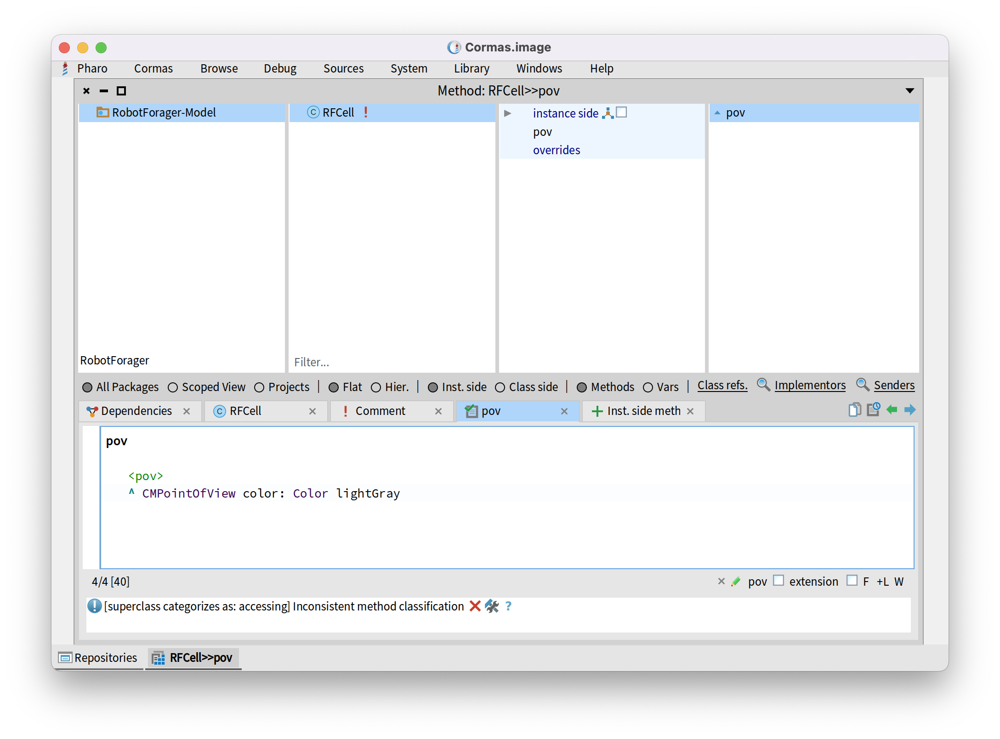

### Step 8. Add Your Packages to Iceberg

If we want to commit and push our code, first we need to add it to the Iceberg. To do that, we have to open _"Repositores" and open our repository we created in previous steps. It should look as empty as the following picture. 

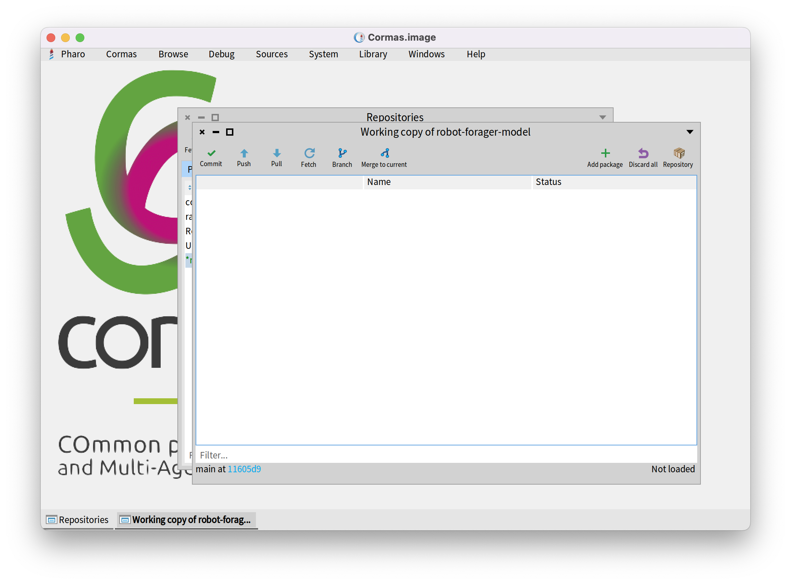

Click on _"Add package"_ button in the top right corner. In the search bar, write the keyword of the package you want to add. For us it is: _"Robo"_ as in _"RobotForager-Model"_. Our package should now pop-up. Check the check-box on its left side and press _"Ok"_. 
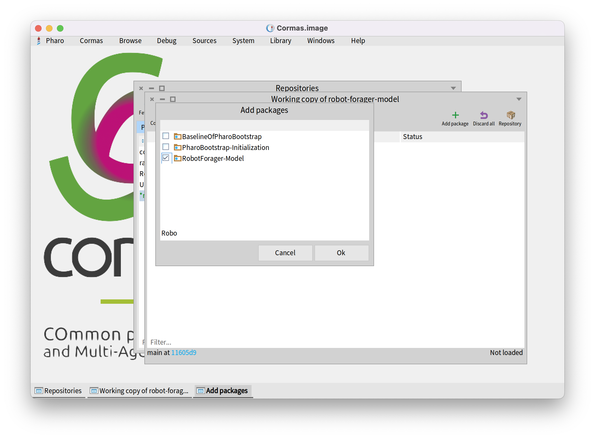

### Step 9. Commit and Push

The next thing we want to do is commit and push. To do that, click on _"Commit"_ button in the top left corner. 

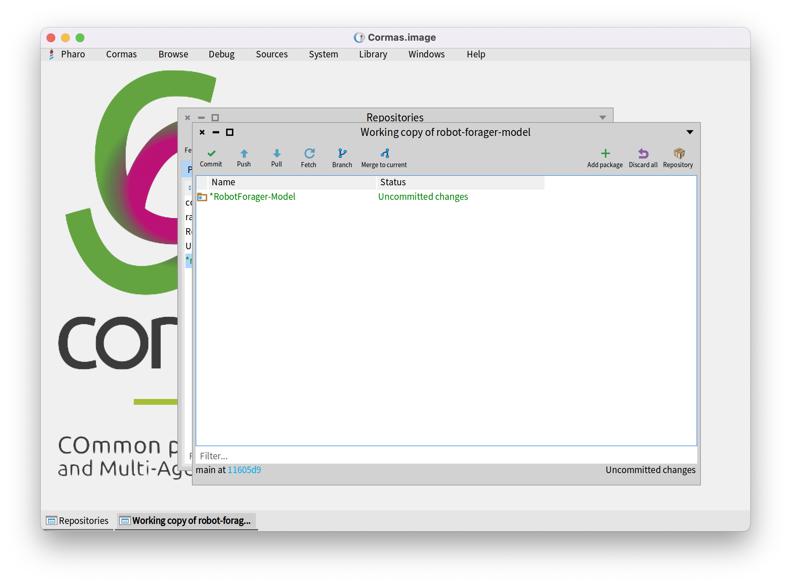

The new tab will have four boxes. First, top left box shows what changes you made in package. You can uncheck and check specific changes if you want to push them or not. Second, top middle box shows how repository looked before the change we made. Third, top right box shows how repository looks after our changes. Fourth, bottom box is for commenting the commit message. 
Commenting on a commit message is crucial because it helps keep track of the changes made to the project. Clear and concise commit messages allow other collaborators (or even yourself in the future) to quickly understand what was changed and why. It provides context for the code, making collaboration smoother and debugging easier. A well-written commit message is like a note to the future you or the team.
Over the comment box there is a check-box. If you check it, your changes will be automatically pushed to the GitHub. If you uncheck it, you will have to push changes manually.

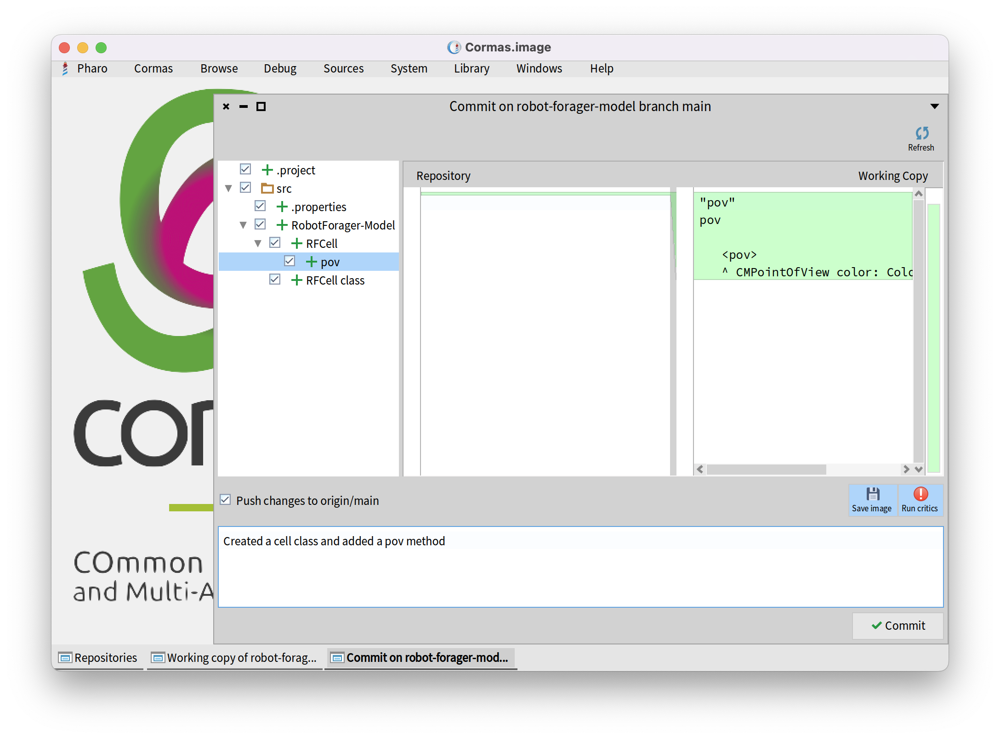

Two other options, which we can turn on, are _"Save image"_, which will automatically save the image after the commit, and _"Run critics"_ which will review and provide discussion of code analyzing, and providing feedback on specific aspects of the code.

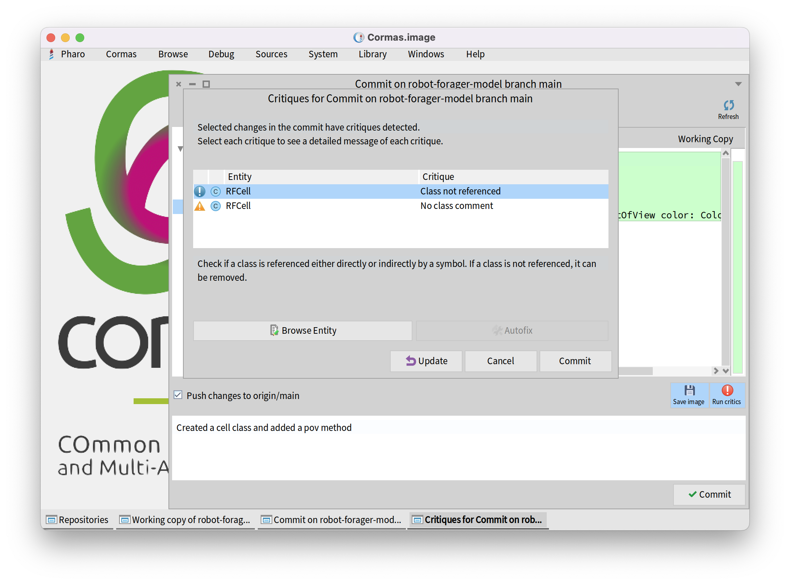

### Step 10. Add a Baseline

### Step 11. Load Your Project in a New Pharo Image

### Step 12. Make Changes in a New Image

### Step 13. Pull Your Changes Into the Old Image

## Related Materials

Source code and documentation of Iceberg on GitHub: https://github.com/pharo-vcs/iceberg

### Videos from Pharo MOOC

_(complete Pharo MOOC: [Live Object Programming in Pharo](https://www.fun-mooc.fr/en/courses/live-object-programming-pharo/) - available in English and French)_

- [Git: New project creation](https://youtu.be/k5KlIzAeqfA)
- [Git: Creating a remote repository to an existing project](https://youtu.be/GzwmGyW6a54)
- [Git: Loading a project with Metacello](https://youtu.be/Q7CiFN3Q12A)

### Pharo Wiki

- [A detailed guide on Baselines](https://github.com/pharo-open-documentation/pharo-wiki/blob/master/General/Baselines.md)
- [Setting up your continuous integration via GitHub Actions](https://github.com/pharo-open-documentation/pharo-wiki/blob/master/General/GithubActions.md)
