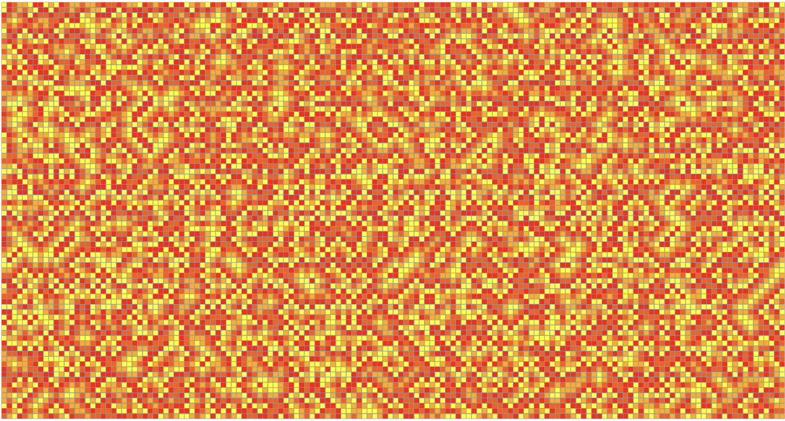
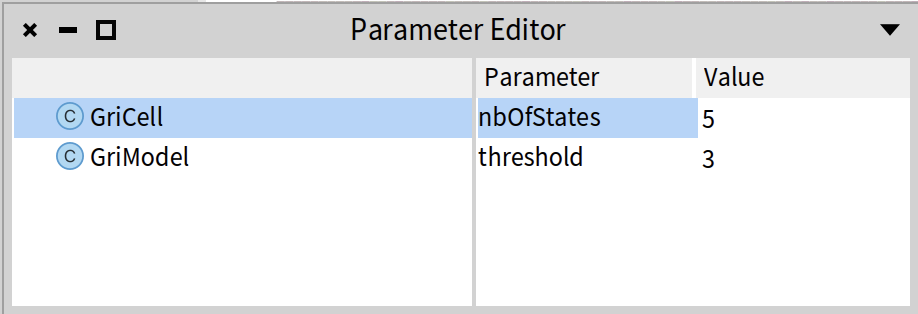

# Griffeath-model
This cyclic cellular automaton is a kind of automaton rule invented by David Griffeath from University of Wisconsin – Madison.
## Standard version
This auto-reproductive cell automaton is two-dimensional, and its cells can take four states (1, 2, 3 or 4) in the standard version. 
### Description
The state of a cell at time t + 1 depends on its state at time t and the state of its 4 neighbors (Von Neumann's neighborhood). 
A cell moves from a state i to a state i + 1 (mod 4) in the state cycle when the state i + 1 (mod 4) is present in at least one neighboring cell.

### Run the standard version in Cormas
1. Load the model
2. Prepare the simulation:
  - init method = `initRandomSpace_VonNeuman` _(4 neighbours)_
  - step method = `stepStandard`
  - click on the `Reinitialize simulation` button, then
  - click on the `Run` button
You should get something like:

Example of space at step 512, with random seed fixed at 111054449681629184  
  
## Version with threshold
### Description
For 8 neighbors (Moore), Griffeath did modifications by adding a threshold (3 by default) for wich a cell changes its state:

For this version, if you simulate with 5 states, you may observe such figure:

### Run the version with threshold in Cormas
1. Load the model
2. Prepare the simulation:
  - set the number of states to 5
    - click on the `Parameter Editor` button, and
    - change the parameter `nbOfStates` from 4 to 5:
      
      
    - init method = `initRandomSpace_Moore` _(8 neighbours)_
    - step method = `stepThreshold`
    - click on the `Reinitialize simulation` button, then
    - click on the `Run` button

You should get something like:

Example of space at step 512, with random seed fixed at 111054449681629184  

## Version with range of states
The current cell in state i checks its state against the neighbors' states. If 3 (threshold) or more neighbors have a state between (i+1) and (i + nbStates/3), then the current cell changes to that state. 
For example, if the current cell state is 2, and 3 of its  neighbors are in state 3 to 6, then the current cell changes its state to 3:

For this version, if you simulate with 14 states, you may observe such figure:

