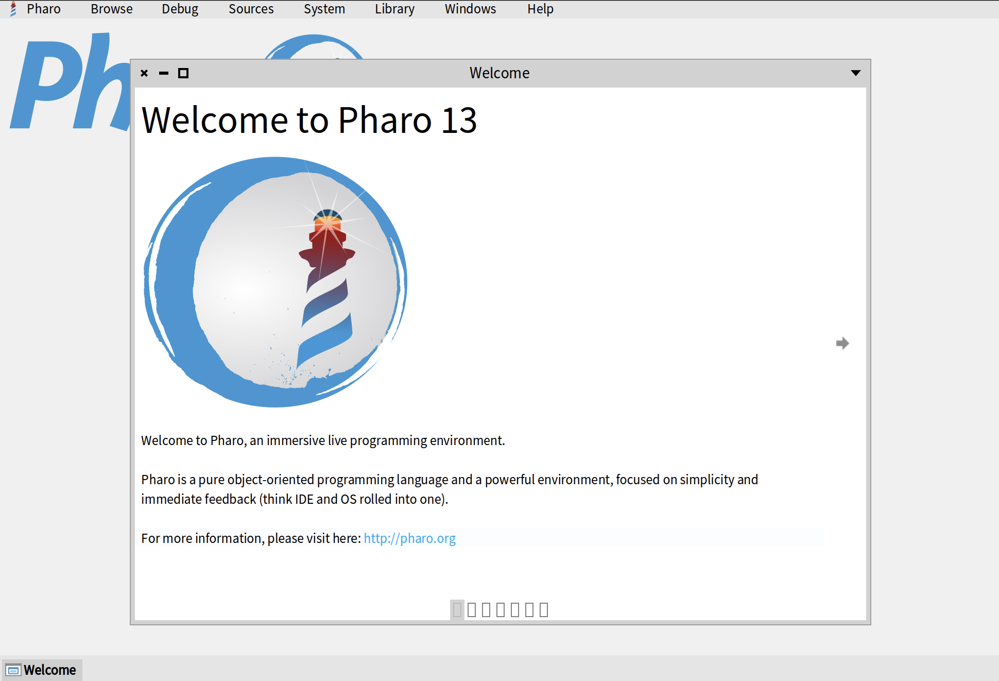
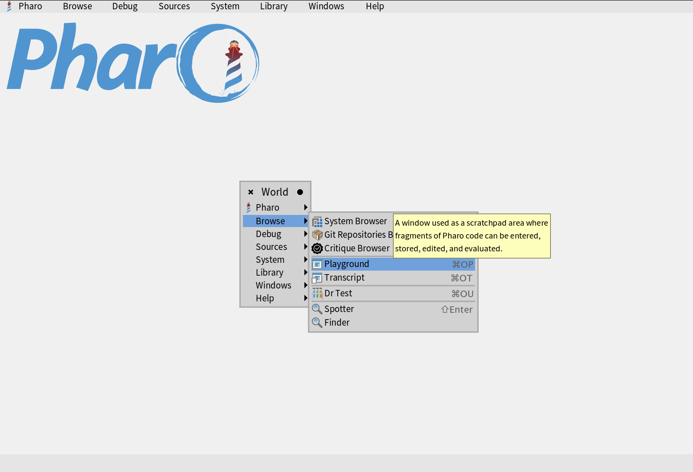

# Basics of Pharo Environment

In this short guide we will teach you how to use navigate the Pharo environment and use 4 main tools: Playground, Inspector, System Browser, and Debugger.

## Welcome Window

When you first open a Pharo image, you will be presented with a Welcome window. It contains a lot of useful information, including links to our learning resources, `ProfStef` tutorial, different themes for Pharo, etc.

You can navigate through the Welcome Window by clicking on little arrows on the left and right sides.

If you close the Welcome Window and want to open it again later, you can do so by clicking on _About > Welcome to Pharo_.

## World Menu

Once you close the welcome window, you will be presented with an empty environment with a Pharo logo in the top-left corner. This space is called _"Pharo World"_. On top of your world, you wll see a menu which we call _"World Menu"_. It allows us to access all the main tools of Pharo, manage Pharo image, access image settings, etc.

You can also access World Menu by right-clicking anwhere in your world. It will be exactly the same menu.

## Playground

The first tool that you will learn is called _"Playground"_. It allows us to execute code and try different code snippets. As a general rule, **we don't program in Playground**. As the name suggests, it is only used for trying out different things. The actual code is written in _"System Browser"_, a tool that will be presented in the following sections. To open Playground, you can select _Browse > Playground_ in your world menu. You can also use a keyboard shortcut _Ctrl+OP_ on Windows or Linux or _Cmd+OP_ on Mac.

## Inspector

## System Browser

## Debugger

## Spotter

## Finder

## Browse Implementors

## Browse Senders

