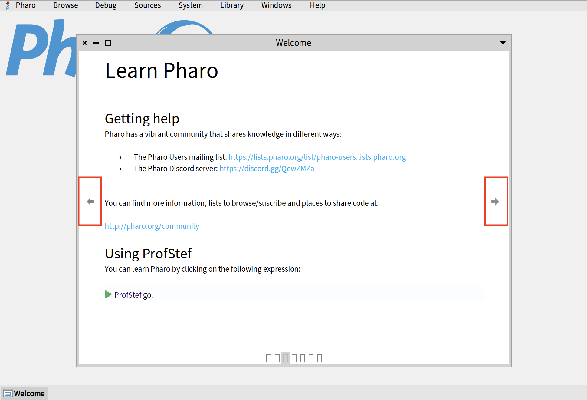
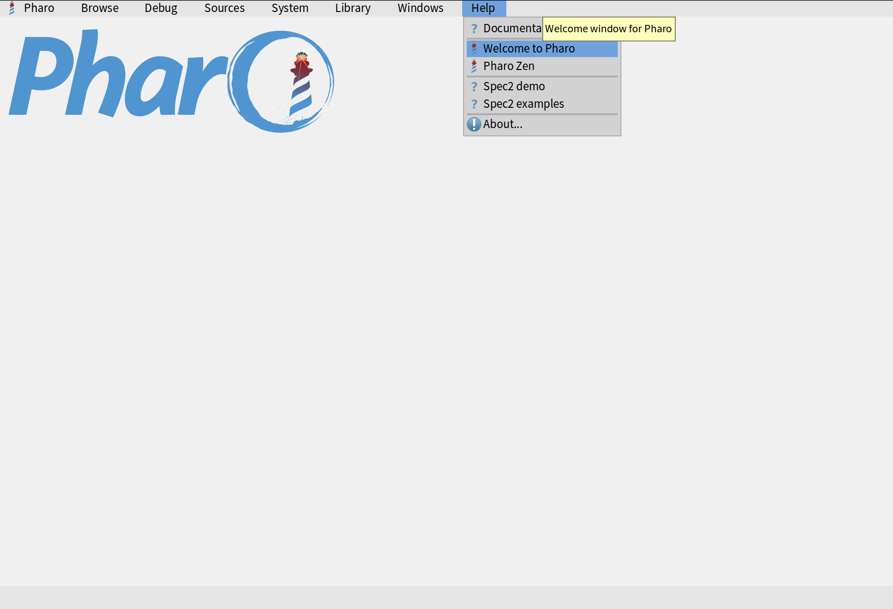

# Basics of Pharo Environment

In this short guide we will teach you how to use navigate the Pharo environment and use 4 main tools: Playground, Inspector, System Browser, and Debugger. We will also teach you how to search for methods and classes with Spotter and how to browse implementors and senders of different methods and classes.

## Welcome Window

When you first open a Pharo image, you will be presented with a Welcome window. It contains a lot of useful information, including links to our learning resources, `ProfStef` tutorial, different themes for Pharo, etc.


You can navigate through the Welcome Window by clicking on little arrows on the left and right sides.



If you close the Welcome Window and want to open it again later, you can do so by clicking on _About > Welcome to Pharo_.



## World Menu

Once you close the welcome window, you will be presented with an empty environment with a Pharo logo in the top-left corner. This space is called _"Pharo World"_. On top of your world, you wll see a menu which we call _"World Menu"_. It allows us to access all the main tools of Pharo, manage Pharo image, access image settings, etc.


You can also access World Menu by right-clicking anwhere in your world. It will be exactly the same menu.


## Playground

The first tool that you will learn is called _"Playground"_. It allows us to execute code and try different code snippets. As a general rule, **we don't program in Playground**. As the name suggests, it is only used for trying out different things. The actual code is written in _"System Browser"_, a tool that will be presented in the following sections. To open Playground, you can select _Browse > Playground_ in your world menu. You can also use a keyboard shortcut _Ctrl+OP_ on Windows or Linux or _Cmd+OP_ on Mac.


Copy the following two lines to your Playground and click on _"Do it all"_ button in the top-left corner.

```smalltalk
StWelcomeBrowser open.
Transcript open.
```


This button executes the entire contents of your Playground. In this case, it will execute two lines that we wrote: first it will open the Welcome Window, then it will open a Transcript (another tool that you will learn in the following sections). _"Do it all"_ button will also open an inspector in the right half of your Playground on the object returned by the last line. We will explain Inspector in the next sections. For now, you can just close it by clicking on the little cross in the top-right corner.


You can also execute one specific line by placing your cursor on it, right clicking and selecting _Do it_ from the menu. Alternatively, you can use a keyboard shortcut _Ctrl+D_ on Windows and Linux or _Cmd+D_ on Mac. If you want to execute multiple lines at one, select them with your mouse and do the same.


Let's add some more lines, evaluate (execute) them and print the result. Don't worry if the variables are highlighted in red. This happens because they are not explicitly declared. But as soon as you execute your code in the Playground, it will automatically declare all varibles for you. Select the lines that you added, right-click and select _Print it_ from the menu. You can also use the shortcut _Ctrl+P_ or _Cmd+P_ on Mac. 

```smalltalk
a := 25.
b := 75.
a + b
```


## Inspector

The second important tool that you must learn is called _Inspector_. It is a window that represents an object. The default inspector will show you the propertioes of an object and allow you to interact with it by sending messages. You can also define custom tabs for an inspector to add custom representations (e.g., visualizations, tables, graphs, etc.) for your objects.

Let's start with a simple example. In your Playground, write the following, right-click on in and select _Inspect it_ from the menu. You can also use the keyboard shortcut _Ctrl+I_ or _Cmd+I_ on Mac.

```smalltalk
4@2
```


This will create a new instance of a Point class which represents a point `(4,2)` and open an inspector for this object. The default inspector tab is called _Raw_. It shows you the names and values of all instance variables. In our case, the object has two variables: `x` which holds the value 4 and `y` which holds the value 2.


If you click on any variable in this tab, it will split the window and show another inspector on the right for the object that you selected. In the example below, I click on variable `x` and get an inspector of number 4 which is an instance of `Smallinteger`.


Notice that `Smallinteger` has a custom inspector tab called `Integer` which displays different representations of the number: hexadecimal, octal, binary, etc. Every class can define custom inspector tabs for its objects. For example, `Color indexedColors` returns an array of colors. If you inspect it, you will see a custom inspector tab for `Array` which displays the list of its elements. If you click on one element, you will see a custom inspector tab for `Color` which draws a rectangle of a given color.


To learn more about Inspector and to learn how to create custom tabs, read the [Inspector](https://github.com/pharo-open-documentation/pharo-wiki/blob/master/General/Inspector.md) article of [Pharo Wiki](https://github.com/pharo-open-documentation/pharo-wiki/).

## Transcript

Transcript is a simple logger that can be used to display string outputs. To open the Transcript window, you can either execute (Do it) `Transcript open`, click on _Browse > Transcript_ in the World Menu, or ue the keyboard shortcut _Ctrl+OT_ or _Cmd+OT_ on Mac. Once the Transcript window opens, it might already have some logs written in it. If you are using Pharo 13 or later, you can clear your Transcript by clicking on the _"Clear"_ button in the top-left corner. If you are on the earlier version of Pharo, execute `Transcript clear` in your Playground.


The simple way to write something on a Transcript is by sending a message `show:`. You can also send a message `cr` to create a new line. For example:

```smalltalk
Transcript show: 'Hello world!'; cr.
Transcript show: 'Lorem ipsum dolor sit amet'; cr.
```

A better way of doing so inside a method is by using `trace:` and `traceCr:` messages. Why is it better? Because you can override those messages and easily change all the logging in your application (e.g., log to file or disable logging):

```smalltalk
foo
	self traceCr: 'Hello world!'.
	self trace: 'Lorem ipsum '.
	slef traceCr: 'dolor sit amet'.
```

You can also send `trace` and `traceCr` messages to strings:

```smalltalk
'Hello world!' traceCr.
'Lorem ipsum ' trace.
'dolor sit amet' traceCr.
```

All the code spippets above produce the same Transcript log.


?> It is not a good practice to use Transcript for logging in your application. And even when you use it, there are good and bad ways of doing so. We recommend you to read [Transcript: the misunderstood global](https://thepharo.dev/2020/08/11/transcript-the-misunderstood-global/) - a short blog post by Stéphane Ducasse where he explains how not to use Transcript and proposes several alternatives. That being said, even though experienced Pharo programmers don't like Transcript, this tool is still used a by many people, so it's important that you know it.

## System Browser

## Debugger

## Spotter

## Finder

## Browse Implementors

## Browse Senders


