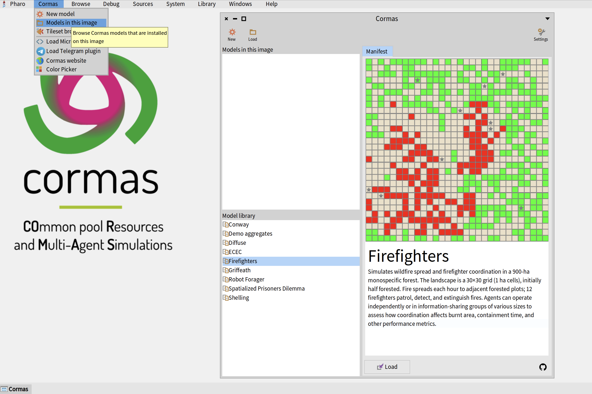
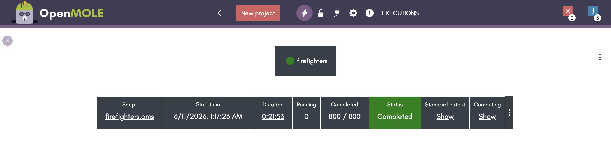
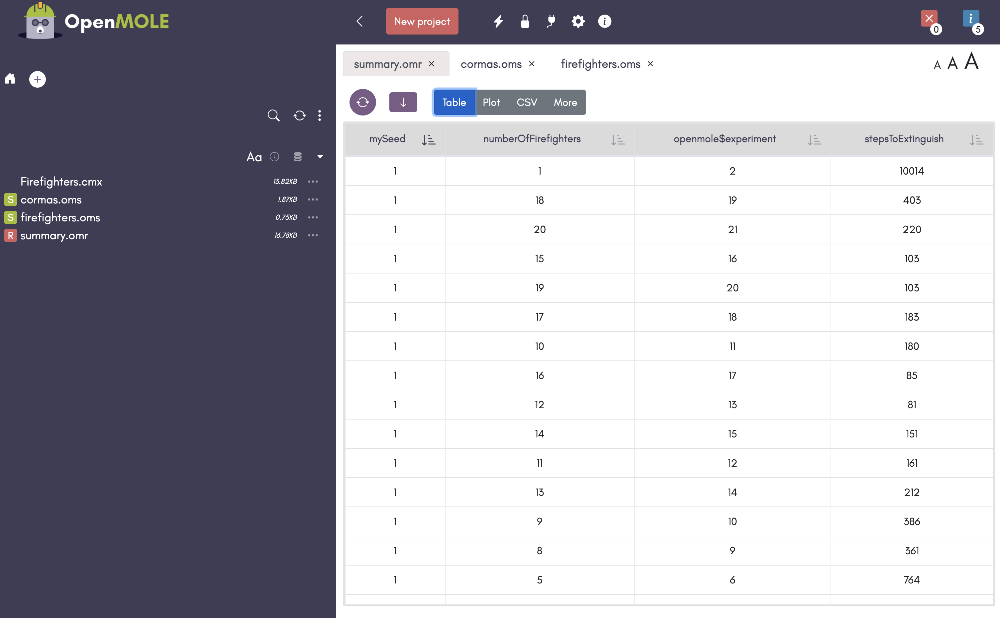
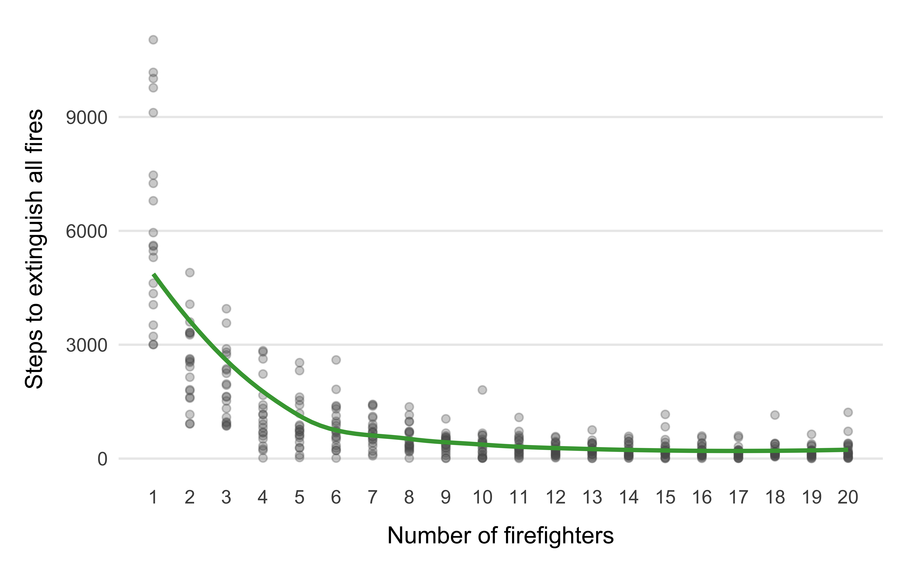
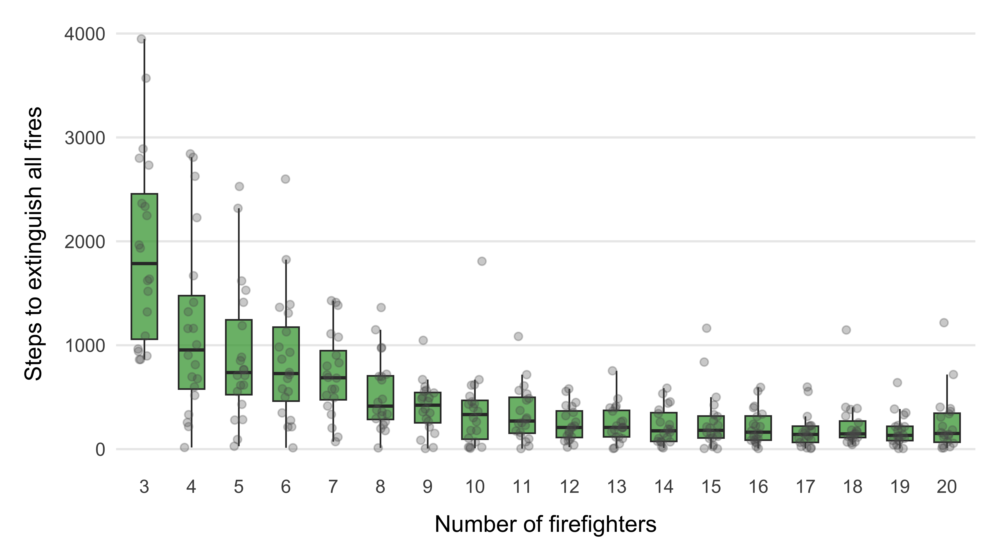

import ExportModel from './img/cormas-export-model.png';

This tutorial explains how to run a Cormas model in OpenMOLE to perform parameter exploration, sensitivity analysis, calibration, or large-scale simulation experiments.

## What is OpenMOLE?

Cormas allows you to run simulations interactively and explore scenarios manually.

When you need to:

* run hundreds or thousands of simulations,
* test many parameter combinations,
* evaluate the impact of randomness,
* perform sensitivity analysis,
* calibrate a model,
* execute simulations on clusters or remote machines,

it becomes impractical to launch simulations manually.

[OpenMOLE](https://openmole.org) is a scientific workflow engine designed for large-scale model exploration. It can automatically execute a Cormas model many times with different parameters and collect the results for analysis.


## Prerequisites

Before using OpenMOLE, make sure that:

1. Cormas is installed (see [Download](/download)).
2. Your model runs correctly inside Cormas.
3. Your model defines parameters and probes.
4. OpenMOLE is installed (follow the instructions on the [Official OpenMOLE Website](https://openmole.org/Download.html)).

:::tip
You can also try the OpenMOLE demo website: [http://demo.openmole.org/app](http://demo.openmole.org/app)
:::

## Overview

The workflow consists of four steps:

1. Export the model from Cormas as a .cmx file.
2. Create an OpenMOLE workflow describing the experiments.
3. Run the workflow.
4. Analyze the generated results.

```
Cormas model
      ↓
   model.cmx
      ↓
   OpenMOLE
      ↓
 Thousands of simulations
      ↓
     CSV
      ↓
 Statistical analysis
```

## Step 0. Get Yourself a Model

In this tutorial we will use the Firefighters model as an example. However, the same workflow can be applied to any Cormas model.

Open Cormas and select _"Models in this Image"_ from the top menu.

In the model browser:

1. Select Firefighters from the list of available models.
2. Click Load.



Once the model is loaded, you can run the simulation normally inside Cormas to verify that everything works correctly before using OpenMOLE.

## Step 1. Export the Model to a File

Before OpenMOLE can execute a Cormas model, the model must be exported as a .cmx file.

Open the Models in this Image window again.

1. Select the model you want to export.
2. Click the small Export button represented by a floppy disk icon.
3. Choose a destination directory.
4. Save the file.

Cormas will create a .cmx file containing the complete model. This file contains everything needed to execute the model and can be transferred to another machine.

The remainder of this tutorial assumes that you have successfully exported a .cmx file.


## Step 2. Prepare OpenMOLE

At this point you should have a model file such as: `Firefighters.cmx`. Open OpenMOLE and create a new empty project. Upload your model file to the project.

You will also need a helper file named `cormas.oms`. Download it from [cormas.oms](https://raw.githubusercontent.com/cormas/cormas-openmole/refs/heads/main/cormas.oms).

:::tip
At the end of this tutorial your OpenMOLE project will contain four files:

* `Firefighters.cmx` - the exported Cormas model,
* `cormas.oms` - the generic bridge between OpenMOLE and Cormas,
* `firefighters.oms` - the workflow describing the experiment.
* `summary.omr` - the results that will be generated by running the experiment.
:::

### What is cormas.oms?

The `cormas.oms` file provides the bridge between OpenMOLE and Cormas.

It defines a reusable task called `CormasTask` that:

* loads a `.cmx` model,
* initializes the simulation,
* sets parameter values,
* runs the model,
* collects probe values,
* returns the results to OpenMOLE.

In most cases you will never need to modify this file. It can be reused for all Cormas models.

## Step 3. Create a Workflow

Next, create a new OpenMOLE script for your model.

In this example, we will create `firefighters.oms` with the following contents to explore how the number of firefighters impacts the number of steps that are needed to extinguish all fires:

```scala title="firefighters.oms"
import _file_.cormas._

val numberOfFirefighters = Val[Int]
val mySeed = Val[Int]

val stepsToExtinguish = Val[Double]

val runCormas = CormasTask(
  image = "oleks42/cormas-openmole:latest",
  modelFile = workDirectory / "Firefighters.cmx",
  initSelector = "basicCreation",
  stepSelector = "basicStep",
  maxSteps = 50000,
  stopCondition = "areAllExtinguished",
  seed = mySeed,
  parameters = Seq(
    numberOfFirefighters -> "numberOfFirefighters",
  ),
  probes = Seq(
    stepsToExtinguish -> "currentTimeStep"
  )
)

val exploration =
  DirectSampling(
    evaluation = runCormas,
    sampling =
      (mySeed in (1 to 20)) x
      (numberOfFirefighters in (1 to 20 by 1))
  )

exploration hook (workDirectory / "summary")
```

### Understanding the Workflow

The workflow describes the experiment that OpenMOLE will execute. It is divided into three parts:

1. Variable declarations
2. Simulation configuration
3. Parameter exploration

#### Declaring Variables

OpenMOLE stores all simulation inputs and outputs in variables. Input variables provide values for model parameters before initializing the simulation. Output variables store the results collected from the simulation (probe values).

```scala
// Input variables
val numberOfFirefighters = Val[Int]
val mySeed = Val[Int]

// Output variables
val stepsToExtinguish = Val[Double]
```

#### Configuring the Simulation

The `CormasTask` describes how a single simulation should be executed.

```scala
val runCormas = CormasTask(...)
```

The Docker image contains Pharo, Cormas, and the code required to execute a simulation. OpenMOLE automatically downloads it if necessary:

```scala
image = "oleks42/cormas-openmole:latest"
```

Model file specifies which model should be executed:

```scala
modelFile = workDirectory / "Firefighters.cmx"
```

Init and step (control) selectors used to initialize the simulation:

```scala
initSelector = "basicCreation",
stepSelector = "basicStep"
```

Maximum number of steps - a safety limit preventing infinite simulations:

```scala
maxSteps = 50000
```

Stop condition is an optional argument that specifies a boolean method executed by a model. The simulation stops when the stop condition returns `true`, **OR** when the maximum number of steps is reached:

```scala
stopCondition = "areAllExtinguished"
```

If your model does not have a stop condition, use

```scala
stopCondition = ""
```

Finally, the `seed` allows OpenMOLE to repeat the simulation with different random seeds:

```scala
seed = mySeed
```

#### Defining Parameters 

Parameters define which model settings can be modified by OpenMOLE. The left side is an OpenMOLE variable. The right side is the corresponding Cormas parameter name.

```scala
parameters = Seq(
  numberOfFirefighters -> "numberOfFirefighters"
)
```

By default, parameters are defined on the model itself. If you want to set the parameters defined on entity classes, write them in a form `ClassName.parameterName`. In the following example, `numberOfFirefighters` and `forestRatio` are model parameters while the `perceptionRange` is a parameter of class `FFFirefighter`: 

```scala
parameters = Seq(
  numberOfFirefighters -> "numberOfFirefighters",
  forestRatio -> "forestRatio",
  perceptionRange -> "FFFirefighter.perceptionRange"
)
```

:::tip
Remember that if you add more parameters, you must define the variables for them in the top part of your workflow file:

```scala
val perceptionRange = Val[Int]
``` 
:::

#### Defining probes

Probes define which values should be collected when the simulation finishes. The left side is an OpenMOLE variable. The right side is a selector executed on the model. The selector is executed once the simulation finishes.

```scala
probes = Seq(
  stepsToExtinguish -> "currentTimeStep"
)
```

Each probe will be executed on a model and must return a number.

:::tip
All probe variables must be of type `Double`.
:::

#### Defining the Exploration

The final section tells OpenMOLE which parameter combinations should be explored. You can read more about different sampling techniques on the [Official OpenMOLE Website](https://openmole.org/Samplings.html).

```scala
val exploration =
  DirectSampling(
    evaluation = runCormas,
    sampling =
      (mySeed in (1 to 20)) x
      (numberOfFirefighters in (1 to 20 by 1))
  )
```

:::tip
Be careful because sampling can quickly make the exploration space very big and if you sample many variables at once, your experiment may take a very long time to complete. For example, if you sample 20 different values for 4 different variables, that would give you 20 * 20 * 20 * 20 = **160,000** simulation runs.

In the example above, we are running 400 simulations and they take about 10 min to complete on my machine (Mac M4 Pro).
:::

#### Saving the Results

The last line of our workflow specifies that the results must be saved in the `summary` file of our work directory:

```scala
exploration hook (workDirectory / "summary")
```

## Step 4. Run the Workflow

Click the **Run** button and wait for the simulations to finish.

Depending on the number of parameter combinations and repetitions, this may take anywhere from a few seconds to several hours.



## Step 5. Download the Data

Once the execution is complete, OpenMOLE will create a new file named `summary.omr` in your project directory.

Click on this file to explore the results. OpenMOLE will display them as a table where each row corresponds to a single simulation run and contains:

* parameter values,
* random seed,
* probe values.



You can then export the results as a CSV file and analyze them using R, Python, Excel, LibreOffice Calc, or any other statistical software.

The exported dataset can be used to create plots, compute summary statistics, perform sensitivity analyses, compare scenarios, or calibrate model parameters.

## Step 6. Visualize the Results

You can now visualize your data with any statistical software. 

For example, the figure below shows a scatter plot of the Firefighters experiment results. Each point represents a single simulation run. The x-axis corresponds to the number of firefighters, while the y-axis shows the number of simulation steps required to extinguish all fires.



This visualization makes it easy to identify the overall trend: increasing the number of firefighters generally reduces the time needed to extinguish the fire, although individual runs may still exhibit significant variability due to randomness.

The next figure presents the same results using box plots.



In this visualization, we only consider runs with at least three firefighters. Including the cases with one or two firefighters stretches the scale considerably and makes the differences between the remaining configurations more difficult to observe.

Each box summarizes the distribution of the time to extinguish for a given number of firefighters. The central line represents the median, the box contains the middle 50% of observations, and the individual points correspond to the raw simulation runs.

Compared to the scatter plot, box plots make it easier to compare the variability and distribution of outcomes across different parameter values.

## Conclusion

At this point you have completed a full OpenMOLE workflow: exporting a Cormas model, defining an experiment, running hundreds of simulations, and analyzing the results. You can now extend the workflow with additional parameters, probes, sampling strategies, sensitivity analyses, calibration methods, or distributed execution on remote machines.