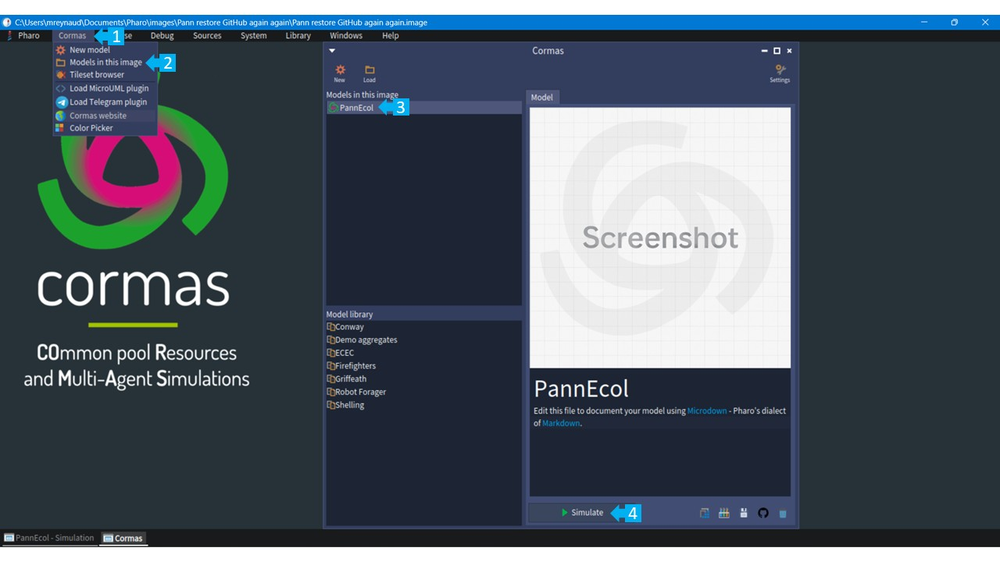
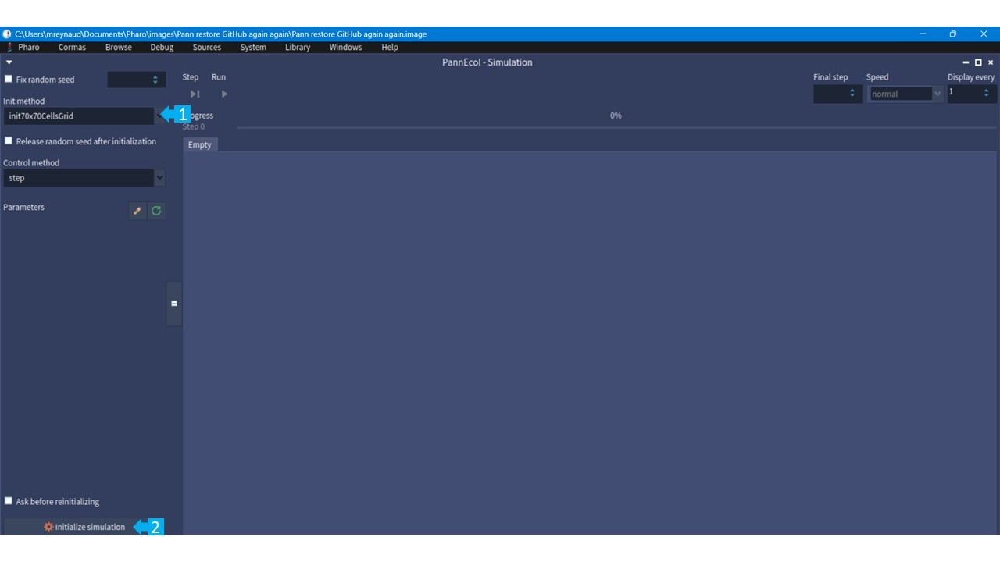

# Paññ Model

The Paññ Model represents the shellfish fishing activity of the bloody cockle (Senilia senilis) in Senegal. It has been co-designed with the stakeholders of Falia and Niodior villages and is used as a participatory tool to collectively reflect on the future of this fishery in a context of social and environmental change.

The model is used to simulate different management scenarios. During role-playing sessions, both individual and collective management strategies were identified. The Paññ model enables the exploration of these strategies over the long term and serves as a discussion support to collectively identify scenarios that could later be tested in situ.


<style>
{`
.model-gallery {
  display: grid;
  grid-template-columns: repeat(3, minmax(0, 1fr));
  gap: 1rem;
  margin: 1.5rem 0;
}

.model-gallery figure {
  margin: 0;
  text-align: center;
}

.model-gallery img {
  width: 100%;
  height: 100%;
  aspect-ratio: 4 / 3;  
  object-fit: cover;
}

.model-gallery figcaption {
  margin-top: 0.5rem;
  font-size: 0.9rem;
}

/* responsive */
@media (max-width: 996px) {
  .model-gallery {
    grid-template-columns: repeat(2, 1fr);
  }
}

@media (max-width: 640px) {
  .model-gallery {
    grid-template-columns: 1fr;
  }
}
`}
</style>

<div className="model-gallery">
  <figure>
    
    <figcaption>A fisher fishing shellfish</figcaption>
  </figure>

  <figure>
    
    <figcaption>Pann model space</figcaption>
  </figure>

  <figure>
    
    <figcaption>Example of results</figcaption>
  </figure>
</div>

## Description

The model is based on a stylized representation of a village surrounded by five mudflats.
It includes two main types of agents:

- Fisherwomen, who harvest shellfish ;
- Shellfish populations (Senilia senilis), which evolve according to ecological dynamics and fishing pressure.

Fishing activities take place during « mbissa », which are 15-day fishing periods separated by one-week breaks, and outside of the biological resting period (initially set from July to October included).
Fisherwomen move across the mudflats (the yellow aggregates) to harvest shellfish. When it’s not fishing period, they return to the village (the brown central cell).

## Run the simulation

If you don't have Cormas installed, you can follow the instructions on the [Download](/download) page. Then, in Cormas image, open your Playground and execute the following script (paste it into the Playground then click on "Do it" to execute it - the green button in the top-left corner):

```Smalltalk
Metacello new
    baseline: 'PannEcolModel';
    repository: 'github://MiaReynaud/pann-ecological-model:main';
    load
```

Open the simulation interface



Select an initialisation method (I recommend the `init70x70CellGrid`) and initialize the simulation



Play with the model: change the parameters, run the simulations, visualize outputs and start again!

## More about this model

The Paññ model is a learning tool built on several interconnected sub-models.

- The biological dynamics of the shellfish (recruitment, growth, and mortality) are based on previous studies led by [Yoann Thomas](https://www-iuem.univ-brest.fr/lemar/equipe/thomas-yoann/).
- Fishing pressure is informed by participatory monitoring conducted by [Yoann Thomas](https://www-iuem.univ-brest.fr/lemar/equipe/thomas-yoann/) and [Claudette Diatta](https://www.researchgate.net/profile/Claudette-Diatta-2).
- Fishing practices are implemented based on fieldwork carried out between 2025 and 2027 by [Mia Reynaud](https://www-iuem.univ-brest.fr/lemar/equipe/reynaud_mia/) and [Aliou Niome](https://sn.linkedin.com/in/aliou-niome-928a95233), including observations, interviews, participatory mapping, questionnaires, counts, mini-games, and modeling workshops.

The workshops in which this model is used are facilitated by [Mia Reynaud](https://www-iuem.univ-brest.fr/lemar/equipe/reynaud_mia/), [Rokhy Fatou Faye](https://sn.linkedin.com/in/fatou-rokhy-daba-faye-115548221), [Claudette Diatta](https://www.researchgate.net/profile/Claudette-Diatta-2) and [Babacar Sané](https://www.researchgate.net/profile/Babacar-Sane).

One of the key challenges of this model is to make simulation results accessible and understandable to fisherwomen with limited formal education (including illiteracy and limited familiarity with statistical concepts), in order to foster inclusive and meaningful collective discussions.


