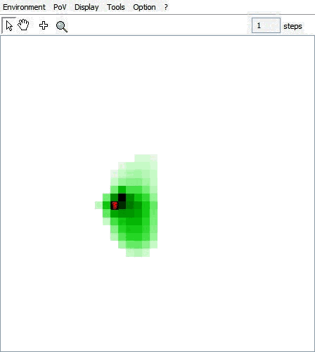
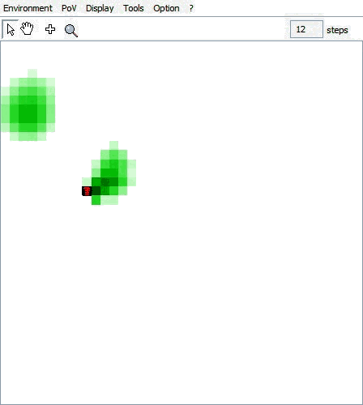

# Diffuse Model

A simple model of pheromone diffusion by ants.
This simple model presents ants that move randomly in a radius of 2 space units and deposits pheromones on the ground. 
The pheromones diffuse on the space and evaporate simultaneously.

There is 2 kinds of entities:
- Ants who deposite hormones on the ground while moving randomly, and
- Cell, in charge of storing hormone (#qty attribute), diffusing it and evaporating it

## Standard version

Diffusion of pheromones (evaporation and synchronous diffusion), then activities of the ants.
In the standard version `stepSynchronously`, the ants move randomly in a radius of 2 cells. 

## Jumping version

In the jumping version `stepSynchronouslyJump`, the ant moves randomly (radius of 2 cells) and deposits pheromone. But if the hormone qty is too elevated, it jumps randomly.

### Run the model in Cormas

1. Load the model
2. Prepare the simulation:
  - init method = `init` _(4 neighbours)_
  - step method = `stepSynchronously` (or `stepSynchronouslyJump`) 
  - click on the `Reinitialize simulation` button, then
  - click on the `Run` button

  
