# ECEC Model

The model we present here has been replicated from a paper by Pepper and Smuts, "Evolution of Cooperation in an Ecological Context":

> Pepper, J.W. and B.B. Smuts. 2000. "The evolution of cooperation in an ecological context: an agent-based model". Pp. 45-76 in T.A. Kohler and G.J. Gumerman, eds. Dynamics of human and primate societies: agent-based modeling of social and spatial processes. Oxford University Press, Oxford.

> Pepper, J.W. and B.B. Smuts. 2002. "Assortment through Environmental Feedback". American Naturalist, 160: 205-213

The model consists of a two-dimensional grid of cells that contain plants and ruminants. 
The main idea is to study the survival of two populations of ruminants (called foragers) that compete for plants. 

## Description of [ECEC](https://github.com/cormas/ecec-model)

### Dynamics of the plants

The Plants are created only once and have a fixed location. They do not move, die, or reproduce. A plant’s only “behaviors” is to grow (and be eaten by foragers). The plants vary only in their biomass, which represents the amount of food energy available to foragers. At each time unit, this biomass level increases according to a **logistic growth**:

* Biomass(t+1) = Biomass(t) + r.Biomass(t) . [1 - Biomass(t) / K]

The following figure presents the discret logistic equation (with 2 parameters: r and K), and the resulting curve:

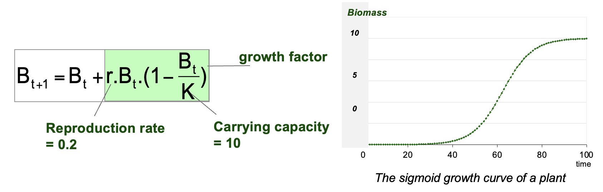

By default, the parameter ***r*** (reproduction rate) is fixed to 0.2 (/step) and the parameter ***K*** (carrying capacity) is fixed to 10 (foragers).

### Dynamics of the foragers

The foragers are ruminants located on the grid that feed on plants. 

#### Foragers loose energy
Each step, the Foragers burn energy according to their **catabolic rate**. This rate is the same for all foragers: it is fixed to **2 units of energy** per time period.
If the energy of a forager reaches 0, it dies.

#### Foragers get energy
A forager feeds on the plant in its current location if there is one. It increases its own energy level by reducing the same amount of the plant. there is no loss.
Foragers are of two types that differs in their feeding behavior:
- When **“Restrained”** foragers eat, they take only **50%** of the plant‟s energy.
- In contrast, **“Unrestrained”** foragers eat **99%** of the plant. This harvest rate is less than 100% so that plants can continue to grow after being fed on, rather than being permanently destroyed.
The Foragers do not change their feeding behavior type and their offspring keep the same heritable traits.

#### Foragers’ Movements
Foragers examine their current location and around (local vision). 
From those not occupied by another forager, they choose the one containing the plant with the highest biomass.
If the chosen plant would yield enough food to meet their catabolic rate (> 2), they move there. 
But if not, they move instead to a random free place.

Foragers examine their current location and around. From those not occupied by another
forager, they choose the one containing the plant with the highest energy.
If the chosen plant would yield enough food to meet their catabolic rate they move there.

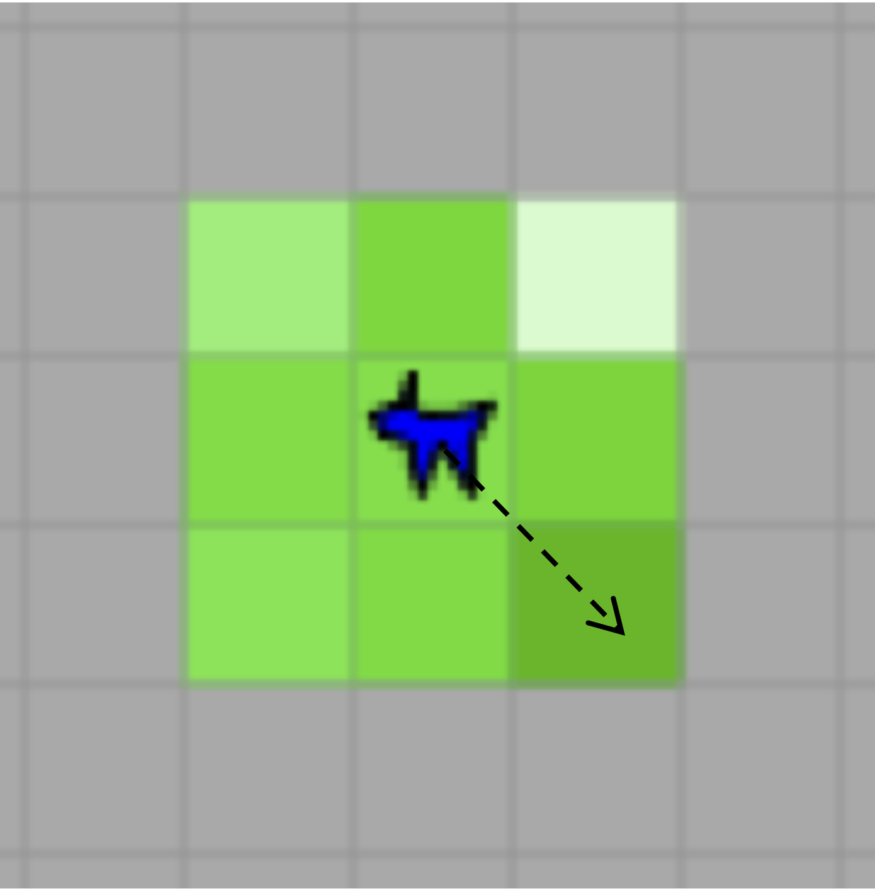

#### Foragers’ Reproduction
If a forager’s energy level reaches an upper **fertility threshold** (100 energy units), it reproduces asexually, creating an offspring with the same heritable traits as itself (e.g., feeding strategy). 
Thus, parent’s energy is reduced by the offspring’s initial energy (50).  
New borns occupy the nearest free place to their parent. 

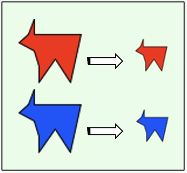

### UML description of ECEC

The following Class diagram presents the structure of the model:

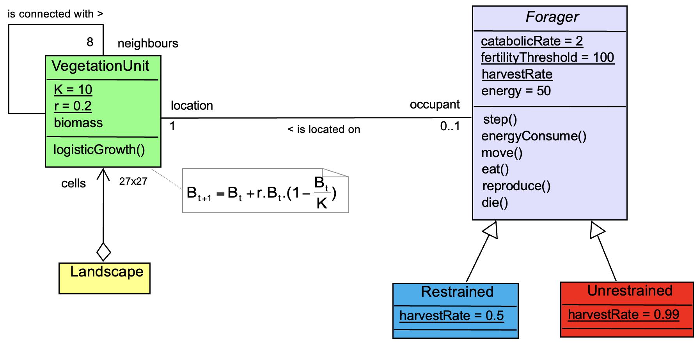
The underlined attributes are called “Class variables”: their values are equal for all instances.
For example, the <ins>catabolicRate</ins> class variable means that its value (2 units of energy) is
identical for every foragers whatever their strategy (restrained or unrestrained).

The following Sequence Diagram presents the main time step of ECEC. This is a DTSS (Discrete Time System Specification, according to Zeigler et al. 2000[^1] classification), meaning that, on the contrary of DEVS (Discrete Event System Specification), the evolution of the simulation is sliced in time steps.
As the model is purely theoretical, the step duration is not defined. In one step, all entities should evolve: the plants increase their biomass (according to Logistic equation), and the foragers perform their biological functions. In order not to give always preference to the same agents (the privilege to choose first the best plant), the list of the foragers is randomly shuffled at each step.

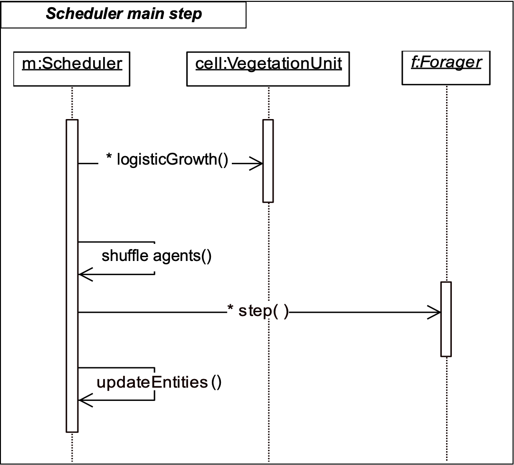

At each step, a forager performs its activities. Its `#step` method is described as the following activity diagram:

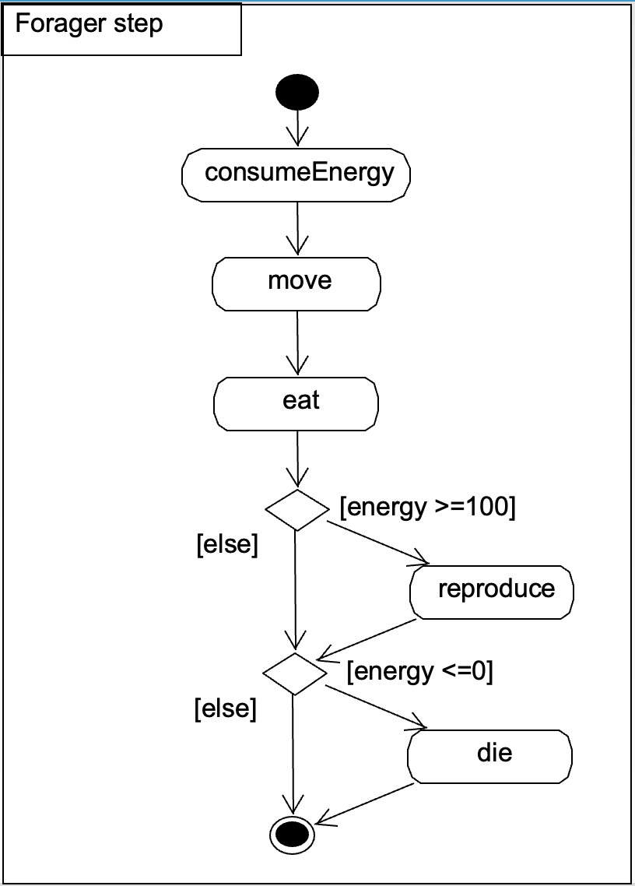

## Running ECEC

### Initialization
By default (cf. initializeParameters[^2], the landscape is a 27 by 27 torroidal grid, with 10 RestrainedForagers and 10 UnrestrainedForagers:

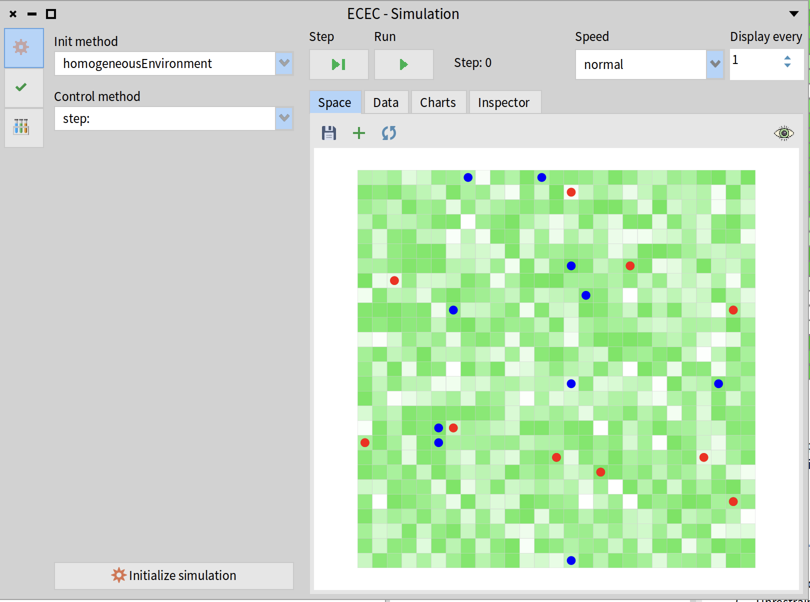

But a simulation can also be initialized without any agent, in order to see the natural evolution of the biomass.

### Analysing ECEC
By running this simulation, we can visualize the mouvements of the agents and the modification of the landscape. We can also observe this simulation with the indicators (called *probes* in Cormas):

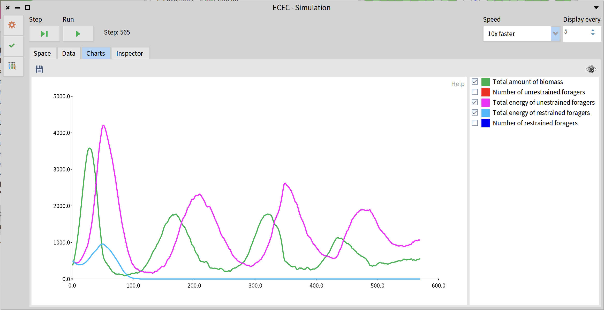

Because the ECEC model is stochastic (there is randomness at intialization, mouvements, and shuffles), simulations must be repeated in order to obtain a more accurate picture of the model’s overall behaviour (rather than relying on a single simulation). The following repeated analysis presents a **‘averaged over repetitions’ analysis**: it calculates the average value of the probe at each step using the average obtained from 100 repetitions

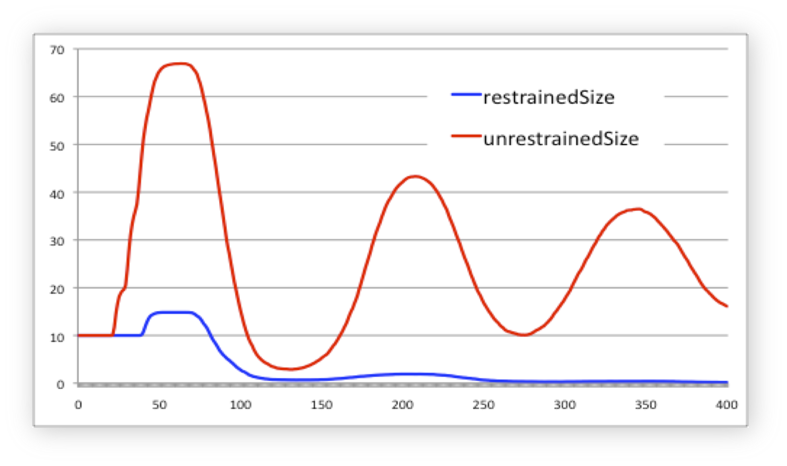

On average, across these 100 simulations, the population of Restrained foragers is eliminated. The ECEC model thus illustrates a process of exclusive competition known as the **‘Principle of Gause’ (1935)**[^3]. G.F. Gause explains that « Two species in biological competition for the same resources cannot permanently coexist »: the species with the best fitness will eliminate the other. The « Fitness » (or selective value, Darwin) is the number of offsprings that reach sexual maturity.

The ECEC model also looks like the famous prey–predator model of Lotka and Volterra (1931):

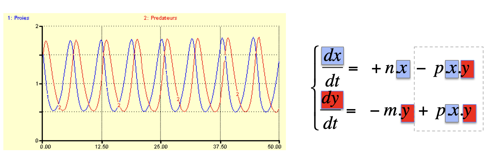 

_For these simulations, the [VENSIM software](https://vensim.com/free-downloads/), an open source system dynamics tool, was used._

The Lotka–Volterra model is a differential equation model in which each line (or equation) represents the fluctuation of a population. In the first equation, the fluctuation in the prey population (dx/dt) depends on the birth rate of the prey (n), minus predation (calculated as the number of preys multiplied by the number of predators multiplied by the predators’ efficiency p). Similarly, the fluctuation in the predator population depends on their natural mortality rate (m), plus predation (preys consumption). Depending on the values of m, n and p, the results of this model can show regular, phase-shifted fluctuations in x (prey) and y (predators).

In ECEC, predators can be considered to be the Foragers, whilst preys are the plants. ECEC shows the same regular fluctuations between the two populations of plants and foragers.

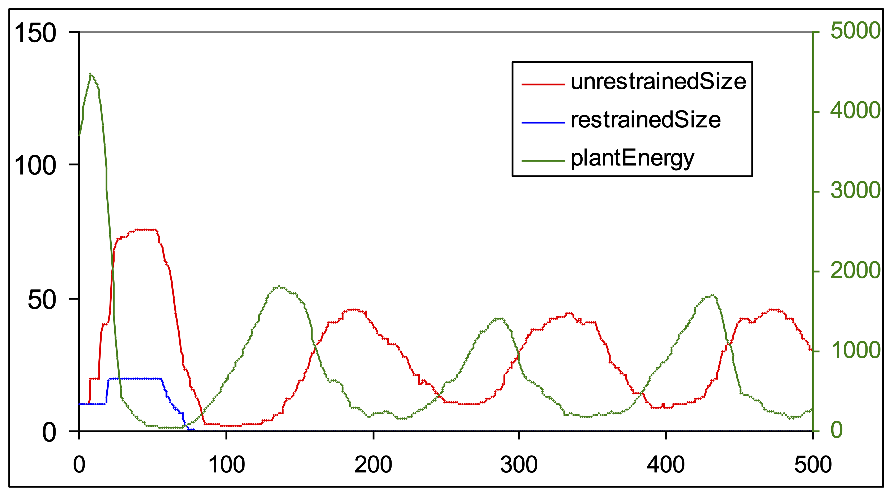

Whilst ECEC provides evidence supporting Gause’s principle (the competitive exclusion of restrained foragers by unrestricted ones) in a homogeneous grid of plants (corroboration), the opposite result (refutation) can also be observed when the landscape consists of oasis-like patches of greenery within a desert:

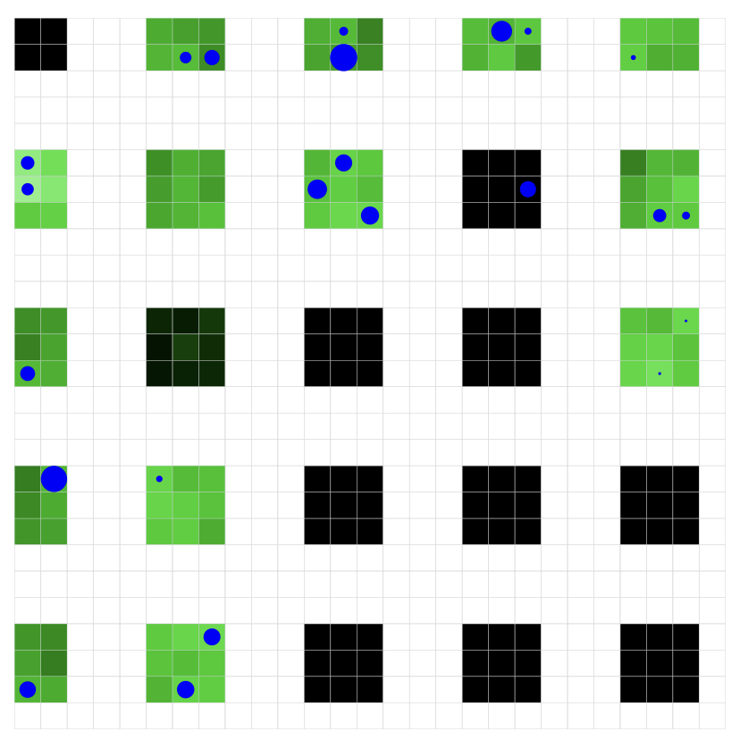

In this particular spatial configuration, the population of Restrained foragers survives whilst the Unrestrained ones die out due to their over-consumption.

Go to the GitHub page of ECEC: https://github.com/cormas/ecec-model or visite the [ECEC page on Cormas VW](https://vw.cormas.org/en/applica/ecec.htm).

[^1]: Zeigler, B.P., Praehofer, H. et Kim, T.G., 2000. (2nd ed.). Theory of modeling and simulation: integrating discrete event and continuous, Academic Press, New York
[^2]: initializeParameters: 
	super initializeParameters.
	numberOfRows := 27.
	numberOfColumns := 27.
	initialNumberOfRestrainedForagers := 10.
	initialNumberOfUnrestrainedForagers := 10

[^3]: Gause G. F., 1935. Vérifications expérimentales de la théorie mathématique de la lutte pour la vie. Hermann et Cie, éditeurs, Paris, France
